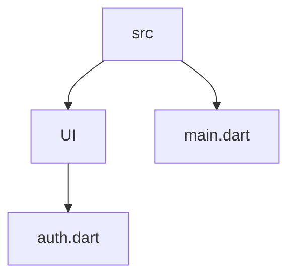

# Chat app

## App & Firebase setup

- Firebase also supports user validation and database storage
- Go to authentication and select Email/Password



## Adding an authentication screen

<image src="https://github.com/PriyathamVarma/Learn-Flutter/blob/main/Images/Simulator%20Screenshot%20-%20iPhone%2015%20Pro%20Max%20-%202024-01-27%20at%2017.13.17.png" height="auto" width=200
/>


- Create a new file ~ `auth.dart`

  
<details>
  <summary>Code</summary>

```dart

import 'package:flutter/material.dart';

class AuthScreen extends StatefulWidget {
  const AuthScreen({super.key});

  @override
  State<AuthScreen> createState() {
    return _AuthScreenState();
  }
}

class _AuthScreenState extends State<AuthScreen> {
  var _isLogin = true;

  @override
  Widget build(BuildContext context) {
    return Scaffold(
      backgroundColor: Theme.of(context).colorScheme.primary,
      body: Center(
        child: SingleChildScrollView(
          child: Column(
            mainAxisAlignment: MainAxisAlignment.center,
            children: [
              Container(
                margin: const EdgeInsets.only(
                  top: 30,
                  bottom: 20,
                  left: 20,
                  right: 20,
                ),
                width: 200,
                child: Image.asset('assets/images/chat.png'),
              ),
              Card(
                margin: const EdgeInsets.all(20),
                child: SingleChildScrollView(
                  child: Padding(
                    padding: const EdgeInsets.all(16),
                    child: Form(
                      child: Column(
                        mainAxisSize: MainAxisSize.min,
                        children: [
                          TextFormField(
                            decoration: const InputDecoration(
                                labelText: 'Email Address'),
                            keyboardType: TextInputType.emailAddress,
                            autocorrect: false,
                            textCapitalization: TextCapitalization.none,
                          ),
                          TextFormField(
                            decoration:
                                const InputDecoration(labelText: 'Password'),
                            obscureText: true,
                          ),
                          const SizedBox(height: 12),
                          ElevatedButton(
                            onPressed: () {},
                            style: ElevatedButton.styleFrom(
                              backgroundColor: Theme.of(context)
                                  .colorScheme
                                  .primaryContainer,
                            ),
                            child: Text(_isLogin ? 'Login' : 'Signup'),
                          ),
                          TextButton(
                            onPressed: () {
                              setState(() {
                                _isLogin = !_isLogin;
                              });
                            },
                            child: Text(_isLogin
                                ? 'Create an account'
                                : 'I already have an account'),
                          ),
                        ],
                      ),
                    ),
                  ),
                ),
              ),
            ],
          ),
        ),
      ),
    );
  }
}


```
  
</details>

> main.dart

<details>
  <summary>Code</summary>

```dart
import 'package:flutter/material.dart';
import 'package:flutter_dotenv/flutter_dotenv.dart';
import 'package:chat_app/src/ui/screens/auth.dart';

void main() async {
  await dotenv.load();

  runApp(const MyApp());
}

class MyApp extends StatelessWidget {
  const MyApp({super.key});

  @override
  Widget build(BuildContext context) {
    // final apiKey = dotenv.get('FIREBAE_REALTIME_DATABASE_URL');
    return MaterialApp(
      title: 'Chat App',
      theme: ThemeData(
        colorScheme: ColorScheme.fromSeed(seedColor: Colors.deepPurple),
        useMaterial3: true,
      ),
      home: Scaffold(
        body: Container(
          child: const Center(
            child: SizedBox(
              child: AuthScreen(),
            ),
          ),
        ),
      ),
    );
  }
}

```
  
</details>


## Validating user input


<details>
  <summary>Code</summary>

```dart

import 'package:flutter/material.dart';

class AuthScreen extends StatefulWidget {
  const AuthScreen({super.key});

  @override
  State<AuthScreen> createState() {
    return _AuthScreenState();
  }
}

class _AuthScreenState extends State<AuthScreen> {
  final _form = GlobalKey<FormState>();

  var _isLogin = true;
  var _enteredEmail = '';
  var _enteredPassword = '';

  void _submit() async {
    final isValid = _form.currentState!.validate();

    if (!isValid) {
      return;
    }

    _form.currentState!.save();
    debugPrint(_enteredEmail);
    debugPrint(_enteredPassword);
  }

  @override
  Widget build(BuildContext context) {
    return Scaffold(
      backgroundColor: Theme.of(context).colorScheme.primary,
      body: Center(
        child: SingleChildScrollView(
          child: Column(
            mainAxisAlignment: MainAxisAlignment.center,
            children: [
              Container(
                margin: const EdgeInsets.only(
                  top: 30,
                  bottom: 20,
                  left: 20,
                  right: 20,
                ),
                width: 200,
                child: Image.asset('assets/images/chat.png'),
              ),
              Card(
                margin: const EdgeInsets.all(20),
                child: SingleChildScrollView(
                  child: Padding(
                    padding: const EdgeInsets.all(16),
                    child: Form(
                      key: _form,
                      child: Column(
                        mainAxisSize: MainAxisSize.min,
                        children: [
                          TextFormField(
                            decoration: const InputDecoration(
                                labelText: 'Email Address'),
                            keyboardType: TextInputType.emailAddress,
                            autocorrect: false,
                            textCapitalization: TextCapitalization.none,
                            validator: (value) {
                              if (value == null ||
                                  value.trim().isEmpty ||
                                  !value.contains('@')) {
                                return 'Please enter a valid email address.';
                              }

                              return null;
                            },
                            onSaved: (value) {
                              _enteredEmail = value!;
                            },
                          ),
                          TextFormField(
                            decoration:
                                const InputDecoration(labelText: 'Password'),
                            obscureText: true,
                            validator: (value) {
                              if (value == null || value.trim().length < 6) {
                                return 'Password must be at least 6 characters long.';
                              }
                              return null;
                            },
                            onSaved: (value) {
                              _enteredPassword = value!;
                            },
                          ),
                          const SizedBox(height: 12),
                          ElevatedButton(
                            onPressed: _submit,
                            style: ElevatedButton.styleFrom(
                              backgroundColor: Theme.of(context)
                                  .colorScheme
                                  .primaryContainer,
                            ),
                            child: Text(_isLogin ? 'Login' : 'Signup'),
                          ),
                          TextButton(
                            onPressed: () {
                              setState(() {
                                _isLogin = !_isLogin;
                              });
                            },
                            child: Text(_isLogin
                                ? 'Create an account'
                                : 'I already have an account'),
                          ),
                        ],
                      ),
                    ),
                  ),
                ),
              ),
            ],
          ),
        ),
      ),
    );
  }
}


```
  
</details>


## Firebase CLI & SDK setup

- Use firebase [SDK](https://firebase.google.com/docs/flutter/setup?platform=ios) for flutter.
- Install firebase CLI `curl -sL https://firebase.tools | bash`
- `firebase login`
- `dart pub global activate flutterfire_cli`
- add `export PATH="$PATH":"$HOME/.pub-cache/bin"` to the .zshrc file which can be found by Terminal > `open ~/.zshrc`
- add `flutterfire configure`
- 


<details>
  <summary>Code</summary>

```dart

```
  
</details>


<details>
  <summary>Code</summary>

```dart

```
  
</details>


<details>
  <summary>Code</summary>

```dart

```
  
</details>
