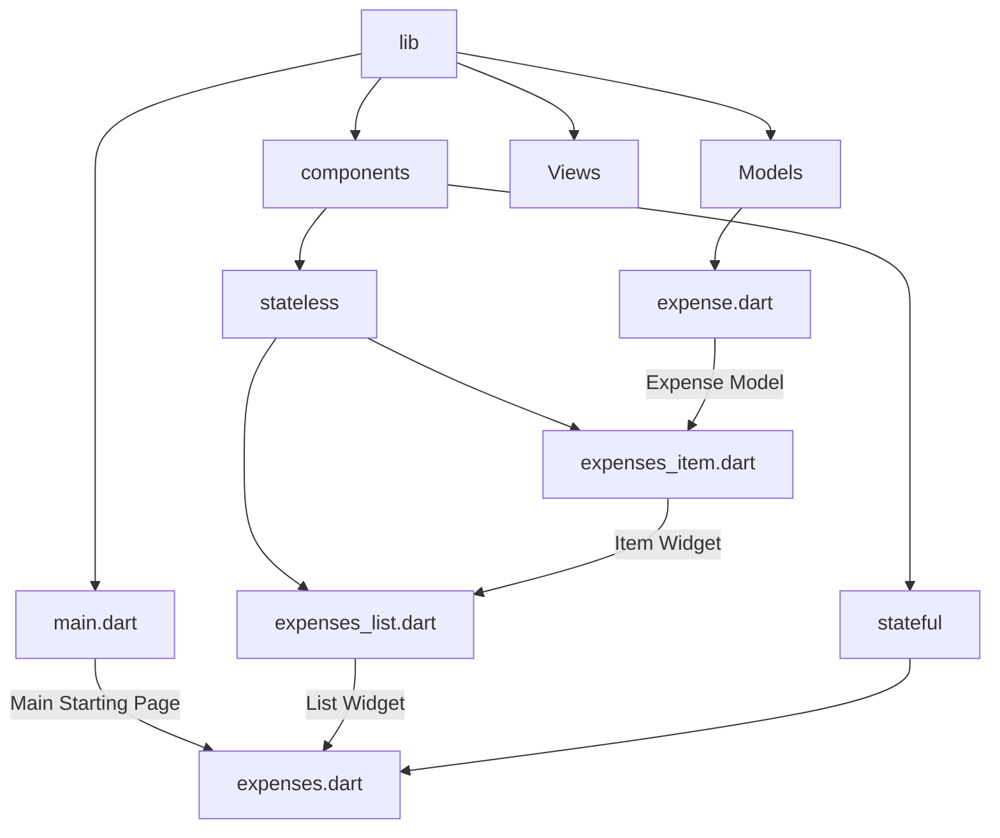
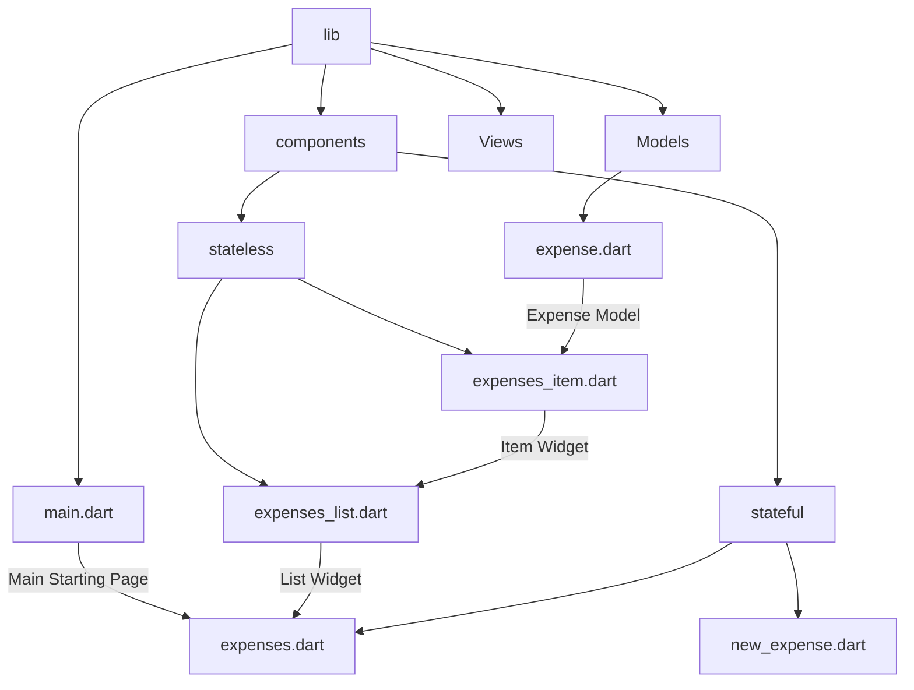

[<-- README.md](https://github.com/PriyathamVarma/Learn-Flutter/blob/main/Expense-App/README.md) | [Part 02 -->](https://github.com/PriyathamVarma/Learn-Flutter/blob/main/Expense-App/Part-02.md)


## Creating a custom List with card and spacer widgets



- Now, in the expense list create a widget to render a single item
- Wrap it in a card which displays all the information
- Pass the item widget to the `expenses_list.dart` file

> expense_item.dart 

<details>
  <summary>Code</summary>
  
```dart
/* 
  This is for the Expense Item
*/

import 'package:intl/intl.dart';

import 'package:expensez/models/expense.dart';
import 'package:flutter/material.dart';
// import 'package:flutter/widgets.dart';

class ExpenseItem extends StatelessWidget {
  const ExpenseItem(this.expense, {super.key});

  final Expense expense;

  @override
  Widget build(BuildContext context) {
    return Card(
      child: Padding(
        padding: const EdgeInsets.all(20.0),
        child: Row(
          mainAxisAlignment: MainAxisAlignment.spaceBetween,
          children: [
            Text(
              DateFormat('MMM dd, yyyy |')
                  .format(expense.date), // Format date according to preference
              style: const TextStyle(fontSize: 10, color: Colors.black),
            ),
            Container(
              padding: const EdgeInsets.symmetric(horizontal: 10.0),
              child: Text(
                expense.title,
                style: const TextStyle(
                  fontSize: 14,
                  color: Colors.black,
                  fontWeight: FontWeight.bold,
                ),
              ),
            ),
            Row(
              mainAxisAlignment: MainAxisAlignment.end,
              children: [
                Text(
                  '\$${expense.amount.toStringAsFixed(2)} ', // Format amount with two decimal places
                  style: const TextStyle(fontSize: 14, color: Colors.black),
                ),
                const SizedBox(
                    width: 8.0), // Small space between amount and date
              ],
            ),
          ],
        ),
      ),
    );
  }
}

```  
</details>  

## Using Icons

> model/expense.dart

<details>
  <summary> Code </summary>

```dart
/*
  This model is for expenses
*/

// Imports
import 'package:flutter/material.dart';
import 'package:uuid/uuid.dart';

const uuid = Uuid();

// Enums
enum Category { food, leisure, entertainment, travel }

// Icons
const categoryIcons = {
  Category.food: Icons.lunch_dining_rounded,
  Category.leisure: Icons.movie_creation_rounded,
  Category.entertainment: Icons.park_rounded,
  Category.travel: Icons.travel_explore_rounded,
};

class Expense {
  // Constructor
  Expense(
      {required this.title,
      required this.amount,
      required this.date,
      required this.category})
      : id = uuid.v4();

  final String id;
  final String title;
  final double amount;
  final DateTime date;
  final Category category;
}
```  
</details>

> expense_item.dart

<details>
  <summary>Code</summary>

```dart
/* 
  This is for the Expense Item
*/

import 'package:intl/intl.dart';

import 'package:expensez/models/expense.dart';
import 'package:flutter/material.dart';
// import 'package:flutter/widgets.dart';

class ExpenseItem extends StatelessWidget {
  const ExpenseItem(this.expense, {super.key});

  final Expense expense;

  @override
  Widget build(BuildContext context) {
    return Card(
      child: Padding(
        padding: const EdgeInsets.all(20.0),
        child: Row(
          mainAxisAlignment: MainAxisAlignment.spaceBetween,
          children: [
            Text(
              DateFormat('MMM dd, yyyy |')
                  .format(expense.date), // Format date according to preference
              style: const TextStyle(fontSize: 10, color: Colors.black),
            ),
            Icon(categoryIcons[expense.category]),
            Container(
              padding: const EdgeInsets.symmetric(horizontal: 10.0),
              child: Text(
                expense.title,
                style: const TextStyle(
                  fontSize: 14,
                  color: Colors.black,
                  fontWeight: FontWeight.bold,
                ),
              ),
            ),
            Row(
              mainAxisAlignment: MainAxisAlignment.end,
              children: [
                Text(
                  '\$${expense.amount.toStringAsFixed(2)} ', // Format amount with two decimal places
                  style: const TextStyle(fontSize: 14, color: Colors.black),
                ),
                const SizedBox(
                    width: 8.0), // Small space between amount and date
              ],
            ),
          ],
        ),
      ),
    );
  }
}

```
  
</details>

## Appbar with title and actions

> expense.dart

```dart
home: Scaffold(
        appBar: AppBar(
          actions: [
            IconButton(onPressed: onPressed, icon: const Icon(Icons.add))
          ],
        ),
        body: Container(
// remaining code
```


> expense.dart

<details>
  <summary>Full Code</summary>

```dart
/* 
  This is for creating the main
  page that controls the entire
  state of the app
*/

// Imports
// Packages
import "package:expensez/components/stateless/expenses_list.dart";
import "package:flutter/material.dart";
import "package:expensez/models/expense.dart";
// Stateless

// Stateful

// Widget
class ExpenseWidget extends StatefulWidget {
  const ExpenseWidget({super.key});

  @override
  State<ExpenseWidget> createState() {
    return _ExpenseWidgetState();
  }
}

// The return type of DiceRoll class

class _ExpenseWidgetState extends State<ExpenseWidget> {
  final List<Expense> _registeredExpenses = [
    Expense(
      title: "Food from butchers",
      amount: 29.00,
      date: DateTime.now(),
      category: Category.food,
    ),
    Expense(
      title: "Rice from spice baazar",
      amount: 14.00,
      date: DateTime.now(),
      category: Category.food,
    ),
  ];

  // Methods
  onPressed() {
    debugPrint("Pressed AppBar");
  }

  @override
  Widget build(context) {
    return MaterialApp(
      home: Scaffold(
        appBar: AppBar(
          title: const Text("Expense Tracker"),
          actions: [
            IconButton(onPressed: onPressed, icon: const Icon(Icons.add))
          ],
        ),
        body: Container(
          decoration: const BoxDecoration(),
          child: Column(
            mainAxisAlignment:
                MainAxisAlignment.start, // Center children vertically
            children: [
              Center(child: ExpensesList(expenses: _registeredExpenses)),
            ],
          ),
        ),
      ),
    );
  }
}

```
  
</details>

## Creating a modal

```dart
IconButton(onPressed: _openModelBox, icon: const Icon(Icons.add))
```

```dart
 // Modal Box
  void _openModelBox() {
    showModalBottomSheet(
      context: context,
      builder: (ctx) {
        return const Text("Model Box");
      },
    );
  }
```

- Try to change the `main.dart` file a bit

```dart
// This is the main dart file
// IMPORTS
import 'package:flutter/material.dart';
// Stateful
import 'package:expensez/components/stateful/expenses.dart';

void main() {
  runApp(
    MaterialApp(
      theme: ThemeData(useMaterial3: true),
      home: const ExpenseWidget(),
    ),
  );
}
```

- Now, the modal is still not ready.
- Here are a few more things to be done.

## Handling user input(text) with TextField Widget

- Create a new file called `new_expense.dart` , which is a stateful widget



### TextEditingController

- TextEditingController automatically captures the input value.
- When we create a `TextEditingController` we also need to create a dispose method so that the controller can be disposed off when the widget is not in use

```dart
final _titleController = TextEditingController();
final _priceController = TextEditingController();

  @override
  void dispose() {
    _titleController.dispose();
    _priceController.dispose();
    super.dispose();
  }
```

<details>
  <summary>Full Code</summary>

```dart

import 'package:flutter/material.dart';

class NewExpense extends StatefulWidget {
  const NewExpense({super.key});

  @override
  State<NewExpense> createState() => _NewExpenseState();
}

class _NewExpenseState extends State<NewExpense> {
  final _titleController = TextEditingController();
  final _priceController = TextEditingController();

  @override
  void dispose() {
    _titleController.dispose();
    _priceController.dispose();
    super.dispose();
  }

  @override
  Widget build(BuildContext context) {
    return Scaffold(
      body: Padding(
        padding: const EdgeInsets.all(16.0),
        child: Column(
          children: [
            TextField(
              controller: _titleController,
              decoration: const InputDecoration(
                labelText: 'Title',
              ),
            ),
            const SizedBox(height: 16.0),
            TextField(
              controller: _priceController,
              keyboardType: TextInputType.number,
              decoration: const InputDecoration(
                prefixText: '£', // Not needed
                labelText: '£ Price',
              ),
            ),
            const SizedBox(height: 16.0),
            ElevatedButton(
              onPressed: () {
                // Access entered title and price from controllers
                final title = _titleController.text;
                final price = double.parse(_priceController.text);
                debugPrint('$title, $price');

                // Handle expense creation logic here (e.g., add to list)
              },
              child: const Text('Add Expense'),
            ),
          ],
        ),
      ),
    );
  }
}


```
  
</details>

  

[<-- README.md](https://github.com/PriyathamVarma/Learn-Flutter/blob/main/Expense-App/README.md) | [Part 02 -->](https://github.com/PriyathamVarma/Learn-Flutter/blob/main/Expense-App/Part-02.md)


