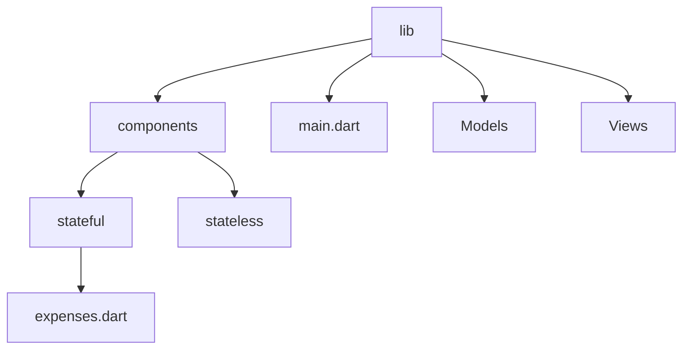
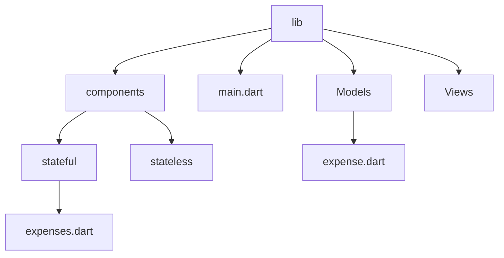
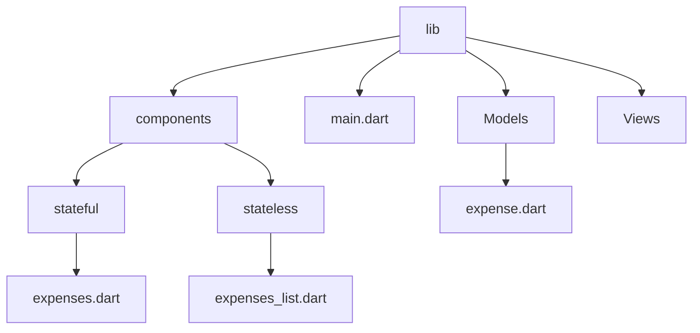

[Part 01 -->](https://github.com/PriyathamVarma/Learn-Flutter/blob/main/Expense-App/Part-01.md)


# Expense Tracker

This is for creating expense tracker app



> main.dart

<details>
  <summary>Code</summary>

```dart
// This is the main dart file
// IMPORTS
import 'package:flutter/material.dart';
// Stateful
import 'package:expensez/components/stateful/expenses.dart';

void main() {
  runApp(
    const ExpenseWidget(),
  );
}

```  
</details>

> expenses.dart

<details>
  <summary>Code</summary>

```dart
/* 
  This is for creating the main
  page that controls the entire
  state of the app
*/

// Imports
// Packages
import "package:flutter/material.dart";
// Stateless

// Stateful

// Widget
class ExpenseWidget extends StatefulWidget {
  const ExpenseWidget({super.key});

  @override
  State<ExpenseWidget> createState() {
    return _ExpenseWidgetState();
  }
}

// The return type of DiceRoll class

class _ExpenseWidgetState extends State<ExpenseWidget> {
  @override
  Widget build(context) {
    return MaterialApp(
      home: Scaffold(
        body: Container(
          decoration: const BoxDecoration(
            gradient: LinearGradient(
              begin: Alignment.topLeft,
              end: Alignment(0.8, 1),
              colors: <Color>[
                Color(0xff1f005c),
                Color(0xff5b0060),
                Color(0xff870160),
                Color(0xffac255e),
                Color(0xffca485c),
                Color(0xffe16b5c),
                Color(0xfff39060),
                Color(0xffffb56b),
              ], // Gradient from https://learnui.design/tools/gradient-generator.html
              tileMode: TileMode.mirror,
            ),
          ),
          child: const Column(
            mainAxisAlignment:
                MainAxisAlignment.center, // Center children vertically
            children: [
              Center(
                child: Text(
                  'Expensez App',
                  style: TextStyle(fontSize: 24, color: Colors.white),
                ),
              ),
            ],
          ),
        ),
      ),
    );
  }
}

```  
</details>




> models/expense.dart
>> flutter pub add uuid

<details>
  <summary>Code</summary>

```dart

/*
  This model is for expenses
*/

// Imports
import 'package:uuid/uuid.dart';

const uuid = Uuid();

class Expense {
  // Constructor
  Expense({required this.title, required this.amount, required this.date})
      : id = uuid.v4();

  final String id;
  final String title;
  final double amount;
  final DateTime date;
}


```  
</details>

## Enums

<details>
  <summary>Code</summary>

```dart

/*
  This model is for expenses
*/

// Imports
import 'package:uuid/uuid.dart';

const uuid = Uuid();

// Enums
enum Category { food, leisure, entertainment, travel }

class Expense {
  // Constructor
  Expense(
      {required this.title,
      required this.amount,
      required this.date,
      required this.category})
      : id = uuid.v4();

  final String id;
  final String title;
  final double amount;
  final DateTime date;
  final Category category;
}


```  
</details>


- Now, use the model to store some dummy data

> expenses.dart

<details>
  <summary>Code</summary>

```dart

/* 
  This is for creating the main
  page that controls the entire
  state of the app
*/

// Imports
// Packages
import "package:flutter/material.dart";
import "package:expensez/models/expense.dart";
// Stateless

// Stateful

// Widget
class ExpenseWidget extends StatefulWidget {
  const ExpenseWidget({super.key});

  @override
  State<ExpenseWidget> createState() {
    return _ExpenseWidgetState();
  }
}

// The return type of DiceRoll class

class _ExpenseWidgetState extends State<ExpenseWidget> {
  final List<Expense> _registeredExpenses = [
    Expense(
        title: "Food from butchers",
        amount: 29.00,
        date: DateTime.now(),
        category: Category.food),
    Expense(
        title: "Rice from spice baazar",
        amount: 14.00,
        date: DateTime.now(),
        category: Category.food),
  ];
  @override
  Widget build(context) {
    return MaterialApp(
      home: Scaffold(
        body: Container(
          decoration: const BoxDecoration(
            gradient: LinearGradient(
              begin: Alignment.topLeft,
              end: Alignment(0.8, 1),
              colors: <Color>[
                Color(0xff1f005c),
                Color(0xff5b0060),
                Color(0xff870160),
                Color(0xffac255e),
                Color(0xffca485c),
                Color(0xffe16b5c),
                Color(0xfff39060),
                Color(0xffffb56b),
              ], // Gradient from https://learnui.design/tools/gradient-generator.html
              tileMode: TileMode.mirror,
            ),
          ),
          child: const Column(
            mainAxisAlignment:
                MainAxisAlignment.center, // Center children vertically
            children: [
              Center(
                child: Text(
                  'Expensez App',
                  style: TextStyle(fontSize: 24, color: Colors.white),
                ),
              ),
            ],
          ),
        ),
      ),
    );
  }
}

```  
</details>

## ListView widget

Now, create a new file/widget which is a stateless widget that takes in the data and renders it in the expenses_widget



> expenses_list.dart

<details>
  <summary>Code</summary>

```dart
/*
  This is for taking in the list
  and rendering them
*/

import 'package:expensez/models/expense.dart';
import 'package:flutter/material.dart';

class ExpensesList extends StatelessWidget {
  const ExpensesList({super.key, required this.expenses});

  final List<Expense> expenses;

  @override
  Widget build(BuildContext context) {
    return ListView.builder(
      shrinkWrap: true,
      itemCount: expenses.length,
      itemBuilder: (ctx, index) => Text(expenses[index].title),
    );
  }
}

```  
</details>

> expenses.dart

<details>
  <summary>Code</summary>

```dart
/* 
  This is for creating the main
  page that controls the entire
  state of the app
*/

// Imports
// Packages
import "package:expensez/components/stateless/expenses_list.dart";
import "package:flutter/material.dart";
import "package:expensez/models/expense.dart";
// Stateless

// Stateful

// Widget
class ExpenseWidget extends StatefulWidget {
  const ExpenseWidget({super.key});

  @override
  State<ExpenseWidget> createState() {
    return _ExpenseWidgetState();
  }
}

// The return type of DiceRoll class

class _ExpenseWidgetState extends State<ExpenseWidget> {
  final List<Expense> _registeredExpenses = [
    Expense(
      title: "Food from butchers",
      amount: 29.00,
      date: DateTime.now(),
      category: Category.food,
    ),
    Expense(
      title: "Rice from spice baazar",
      amount: 14.00,
      date: DateTime.now(),
      category: Category.food,
    ),
  ];
  @override
  Widget build(context) {
    return MaterialApp(
      home: Scaffold(
        body: Container(
          decoration: const BoxDecoration(
            gradient: LinearGradient(
              begin: Alignment.topLeft,
              end: Alignment(0.8, 1),
              colors: <Color>[
                Color(0xff1f005c),
                Color(0xff5b0060),
                Color(0xff870160),
                Color(0xffac255e),
                Color(0xffca485c),
                Color(0xffe16b5c),
                Color(0xfff39060),
                Color(0xffffb56b),
              ], // Gradient from https://learnui.design/tools/gradient-generator.html
              tileMode: TileMode.mirror,
            ),
          ),
          child: Column(
            mainAxisAlignment:
                MainAxisAlignment.center, // Center children vertically
            children: [
              const Center(
                child: Text(
                  'Expensez App',
                  style: TextStyle(fontSize: 24, color: Colors.white),
                ),
              ),
              Center(child: ExpensesList(expenses: _registeredExpenses)),
            ],
          ),
        ),
      ),
    );
  }
}

```
  
</details>

## Resources

1. [UUID package](https://pub.dev/packages/uuid)

[Part 01 -->](https://github.com/PriyathamVarma/Learn-Flutter/blob/main/Expense-App/Part-01.md)
