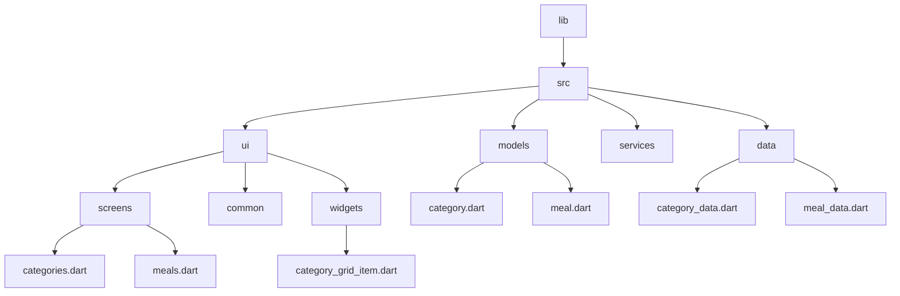

[<-- README.md](https://github.com/PriyathamVarma/Learn-Flutter/blob/main/Meals-App/README.md) | [Part 02 -->](https://github.com/PriyathamVarma/Learn-Flutter/blob/main/Meals-App/Part-02.md)

## Adding meals data

[<-- README.md](https://github.com/PriyathamVarma/Learn-Flutter/blob/main/Meals-App/README.md) | [Part 02 -->](https://github.com/PriyathamVarma/Learn-Flutter/blob/main/Meals-App/Part-02.md)
