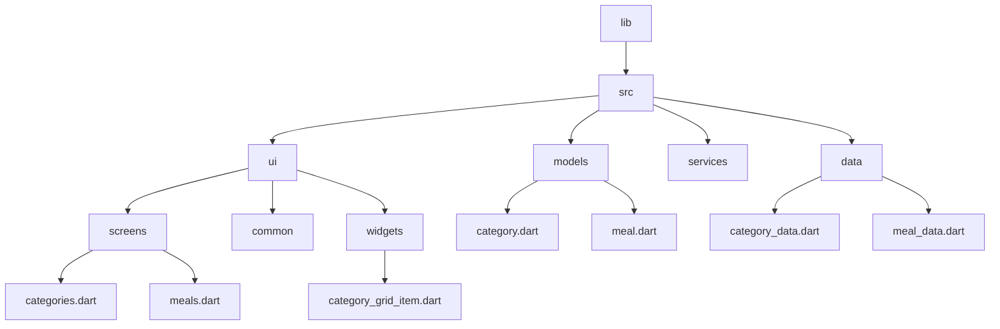

[<-- Part-01.md](https://github.com/PriyathamVarma/Learn-Flutter/blob/main/Meals-App/Part-01.md) | [Part 03 -->](https://github.com/PriyathamVarma/Learn-Flutter/blob/main/Meals-App/Part-03.md)


# Adding Cross Screen Navigation



> screens/categories.dart

<details>
  <summary>Code</summary>

```dart
/* 
  This file is for categories
  listing using Grid view List
*/

import 'package:flutter/material.dart';
import 'package:meals_app/src/data/category_data.dart';
import 'package:meals_app/src/ui/screens/meals.dart';
import 'package:meals_app/src/ui/widgets/category_grid_item.dart';

class CategoriesScreen extends StatelessWidget {
  const CategoriesScreen({super.key});
  void _selectCategory(BuildContext context) {
    Navigator.of(context).push(
      MaterialPageRoute(
          builder: (ctx) => const MealsScreen(title: "title", meals: [])),
    );
  }

  @override
  Widget build(BuildContext context) {
    return Scaffold(
      appBar: AppBar(
        title: const Text("Pick Category"),
        actions: <Widget>[
          IconButton(
            icon: const Icon(Icons.add),
            tooltip: 'Show Snackbar',
            onPressed: () {
              ScaffoldMessenger.of(context).showSnackBar(
                  const SnackBar(content: Text('This is a snackbar')));
            },
          ),
        ],
      ),
      body: GridView(
        padding: const EdgeInsets.all(24),
        gridDelegate: const SliverGridDelegateWithFixedCrossAxisCount(
            crossAxisCount: 2,
            childAspectRatio: 3 / 2,
            crossAxisSpacing: 10,
            mainAxisSpacing: 10),
        children: [
          for (final category in availableCategories)
            CategoryGridItem(
                category: category,
                onSelectcategory: () {
                  _selectCategory(context);
                })
        ],
      ),
    );
  }
}

```  
</details>


> widgets/category_grid_item.dart


<details>
  <summary>Code</summary>

```dart
/* 
  This file is for categories
  listing using Grid view List
*/

import 'package:flutter/material.dart';
import 'package:meals_app/src/data/category_data.dart';
import 'package:meals_app/src/ui/screens/meals.dart';
import 'package:meals_app/src/ui/widgets/category_grid_item.dart';

class CategoriesScreen extends StatelessWidget {
  const CategoriesScreen({super.key});
  void _selectCategory(BuildContext context) {
    Navigator.of(context).push(
      MaterialPageRoute(
          builder: (ctx) => const MealsScreen(title: "title", meals: [])),
    );
  }

  @override
  Widget build(BuildContext context) {
    return Scaffold(
      appBar: AppBar(
        title: const Text("Pick Category"),
        actions: <Widget>[
          IconButton(
            icon: const Icon(Icons.add),
            tooltip: 'Show Snackbar',
            onPressed: () {
              ScaffoldMessenger.of(context).showSnackBar(
                  const SnackBar(content: Text('This is a snackbar')));
            },
          ),
        ],
      ),
      body: GridView(
        padding: const EdgeInsets.all(24),
        gridDelegate: const SliverGridDelegateWithFixedCrossAxisCount(
            crossAxisCount: 2,
            childAspectRatio: 3 / 2,
            crossAxisSpacing: 10,
            mainAxisSpacing: 10),
        children: [
          for (final category in availableCategories)
            CategoryGridItem(
                category: category,
                onSelectcategory: () {
                  _selectCategory(context);
                })
        ],
      ),
    );
  }
}

```  
</details>

[<-- Part-01.md](https://github.com/PriyathamVarma/Learn-Flutter/blob/main/Meals-App/Part-01.md) | [Part 03 -->](https://github.com/PriyathamVarma/Learn-Flutter/blob/main/Meals-App/Part-03.md)
