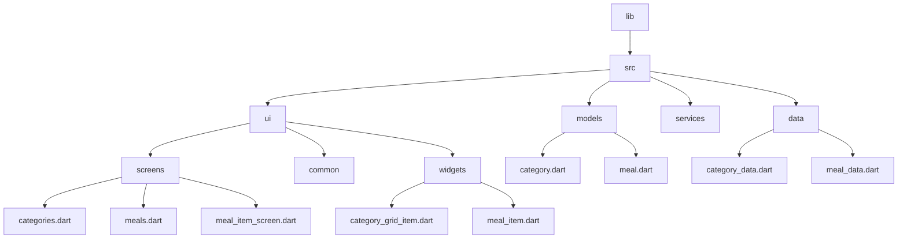
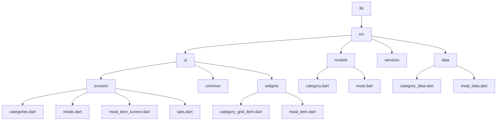

[<-- Part-02.md](https://github.com/PriyathamVarma/Learn-Flutter/blob/main/Meals-App/Part-02.md) | [Part 04 -->](https://github.com/PriyathamVarma/Learn-Flutter/blob/main/Meals-App/Part-04.md)


## Adding navigation to the meal details screen



> widgets/meal_item.dart

<details>
  <summary>Code</summary>

```dart
/*
  This is for meal item
*/

import 'package:flutter/material.dart';
import 'package:meals_app/src/models/meal.dart';
import 'package:meals_app/src/ui/screens/meal_item_screen.dart';
import 'package:transparent_image/transparent_image.dart';

class MealItem extends StatelessWidget {
  const MealItem({
    super.key,
    required this.meal,
  });

  final Meal meal;

  void _selectedMealItem(BuildContext context, Meal meal) {
    Navigator.of(context).push(
      MaterialPageRoute(
        builder: (ctx) => MealItemScreen(mealData: meal),
      ),
    );
  }

  @override
  Widget build(BuildContext context) {
    return Card(
      margin: const EdgeInsets.all(10),
      child: InkWell(
        onTap: () {
          _selectedMealItem(context, meal);
        },
        child: Stack(
          children: [
            FadeInImage(
              placeholder: MemoryImage(kTransparentImage),
              image: NetworkImage(meal.imageUrl),
            ),
            Positioned(
              // top: 20,
              left: 0,
              right: 0,
              bottom: 0,
              child: Container(
                color: Colors.black,
                padding:
                    const EdgeInsets.symmetric(vertical: 2, horizontal: 44),
                child: Column(
                  children: [
                    Text(
                      meal.title,
                      style: const TextStyle(
                        color: Colors.white,
                        fontSize: 14,
                        fontWeight: FontWeight.bold,
                      ),
                    ),
                  ],
                ),
              ),
            ),
          ],
        ),
      ),
    );
  }
}


```
  
</details>

> screens/meal_item_screen.dart

<details>
  <summary>Code</summary>

```dart
/*
  This file is for meal
  item screen
*/
// Imports

import 'package:flutter/material.dart';
import 'package:meals_app/src/models/meal.dart';

class MealItemScreen extends StatelessWidget {
  const MealItemScreen({
    super.key,
    required this.mealData,
  });

  final Meal mealData;

  @override
  Widget build(BuildContext context) {
    return Scaffold(
      appBar: AppBar(
        title: Text(mealData.title),
        actions: <Widget>[
          IconButton(
            icon: const Icon(Icons.add),
            tooltip: 'Show Snackbar',
            onPressed: () {
              ScaffoldMessenger.of(context).showSnackBar(
                  const SnackBar(content: Text('This is a snackbar')));
            },
          ),
        ],
      ),
      body: SingleChildScrollView(
        child: Column(
          children: [
            SizedBox(
              height: 300,
              width: double.infinity,
              child: Image.network(mealData.imageUrl),
            ),
            Padding(
              padding: const EdgeInsets.all(16.0),
              child: Column(
                crossAxisAlignment: CrossAxisAlignment.start,
                children: [
                  Text(
                    'Categories: ${mealData.categories.join(', ')}',
                    style: const TextStyle(fontSize: 16),
                  ),
                  const Text(
                    'Ingredients:',
                    style: TextStyle(fontSize: 18, fontWeight: FontWeight.bold),
                  ),
                  const SizedBox(height: 8),
                  // Display ingredients in a list
                  ListView.builder(
                    shrinkWrap: true,
                    itemCount: mealData.ingredients.length,
                    itemBuilder: (context, index) => Padding(
                      padding: const EdgeInsets.symmetric(vertical: 4),
                      child: Text(
                        '- ${mealData.ingredients[index]}',
                      ),
                    ),
                  ),
                  // ... Display other data fields similarly ...
                  // Text(
                  //   'Steps:',
                  //   style: const TextStyle(
                  //       fontSize: 18, fontWeight: FontWeight.bold),
                  // ),
                  // ... Display steps in a list or custom widget ...
                  // ... Display duration, complexity, affordability, dietary info ...
                ],
              ),
            ),
          ],
        ),
      ),
    );
  }
}


```
  
</details>


## Adding tab-based navigation

- Tab-based navigation provides a clear and intuitive way to organize content in Flutter apps.



> screens/tabs.dart

<details>
  <summary>Code</summary>

```dart

/* 
  This is for tabs navigation
*/

// Imports

import "package:flutter/material.dart";
import "package:meals_app/src/ui/screens/categories.dart";
import "package:meals_app/src/ui/screens/meals.dart";

// Stateless

// Stateful

// Widget
class TabsScreen extends StatefulWidget {
  const TabsScreen({super.key});

  @override
  State<TabsScreen> createState() {
    return _TabsScreenState();
  }
}

// The return type of DiceRoll class

class _TabsScreenState extends State<TabsScreen> {
  int _selectedIndex = 0;

  void _selectedPage(int index) {
    setState(() {
      _selectedIndex = index;
    });
  }

  @override
  Widget build(context) {
    Widget activeScreen = const CategoriesScreen();

    if (_selectedIndex == 1) {
      activeScreen = const MealsScreen(title: "Category", meals: []);
    } else if (_selectedIndex == 2) {
      activeScreen = const MealsScreen(title: "Favorites", meals: []);
    }
    return Scaffold(
      appBar: AppBar(
        title: const Text("Dynamic"),
      ),
      body: activeScreen,
      bottomNavigationBar: BottomNavigationBar(
        onTap: (index) {
          _selectedPage(index);
        },
        items: const [
          BottomNavigationBarItem(icon: Icon(Icons.home), label: "Home"),
          BottomNavigationBarItem(
              icon: Icon(Icons.set_meal), label: "Category"),
          BottomNavigationBarItem(icon: Icon(Icons.star), label: "Favorites"),
        ],
      ),
    );
  }
}

```
  
</details>


> main.dart

<details>
  <summary>Code</summary>

```dart
// This is the main dart file
// IMPORTS
import 'package:flutter/material.dart';
// Screens
import 'package:meals_app/src/ui/screens/tabs.dart';

void main() {
  runApp(
    MaterialApp(
      theme: ThemeData().copyWith(
        scaffoldBackgroundColor: Colors.white,
        cardColor: Colors.amberAccent,
        // textTheme: GoogleFonts.latoTextTheme(),
      ),
      home: const TabsScreen(),
    ),
  );
}


```
  
</details>


<image src="https://github.com/PriyathamVarma/Learn-Flutter/blob/main/Images/Simulator%20Screenshot%20-%20Dice%20Test%20-%202024-01-14%20at%2000.10.04.png" height="auto" width=200 />

[<-- Part-02.md](https://github.com/PriyathamVarma/Learn-Flutter/blob/main/Meals-App/Part-02.md) | [Part 04 -->](https://github.com/PriyathamVarma/Learn-Flutter/blob/main/Meals-App/Part-04.md)
