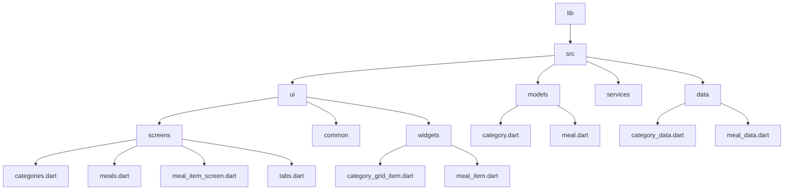
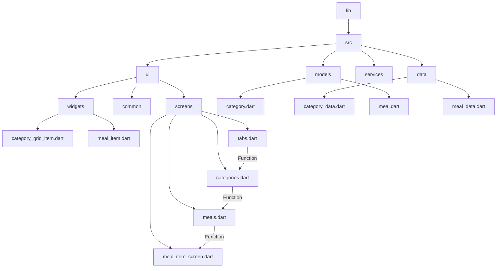

[<-- Part-03.md](https://github.com/PriyathamVarma/Learn-Flutter/blob/main/Meals-App/Part-03.md) | [Part 05 -->](https://github.com/PriyathamVarma/Learn-Flutter/blob/main/Meals-App/Part-05.md)


# State management without any libraries



## Passing functions through multiple layers of widgets



> meal_item_screen.dart

<details>
  <summary>Code</summary>

```dart
/*
  This file is for meal
  item screen
*/
// Imports

// import 'package:flutter/foundation.dart';
import 'package:flutter/material.dart';
import 'package:meals_app/src/models/meal.dart';

class MealItemScreen extends StatelessWidget {
  const MealItemScreen({
    super.key,
    required this.mealData,
    required this.onToggleFavorite,
  });

  final Meal mealData;
  final void Function(Meal meal) onToggleFavorite;

  @override
  Widget build(BuildContext context) {
    return Scaffold(
      appBar: AppBar(
        title: Text(mealData.title),
        actions: [
          IconButton(
            icon: const Icon(Icons.star),
            onPressed: () {
              onToggleFavorite(mealData);
            },
          ),
        ],
      ),
      body: SingleChildScrollView(
        child: Column(
          children: [
            SizedBox(
              height: 300,
              width: double.infinity,
              child: Image.network(mealData.imageUrl),
            ),
            Padding(
              padding: const EdgeInsets.all(16.0),
              child: Column(
                crossAxisAlignment: CrossAxisAlignment.start,
                children: [
                  Text(
                    'Categories: ${mealData.categories.join(', ')}',
                    style: const TextStyle(fontSize: 16),
                  ),
                  const Text(
                    'Ingredients:',
                    style: TextStyle(fontSize: 18, fontWeight: FontWeight.bold),
                  ),
                  const SizedBox(height: 8),
                  // Display ingredients in a list
                  ListView.builder(
                    shrinkWrap: true,
                    itemCount: mealData.ingredients.length,
                    itemBuilder: (context, index) => Padding(
                      padding: const EdgeInsets.symmetric(vertical: 4),
                      child: Text(
                        '- ${mealData.ingredients[index]}',
                      ),
                    ),
                  ),
                  // ... Display other data fields similarly ...
                  const Divider(),
                  const Text(
                    'Steps:',
                    style: TextStyle(fontSize: 18, fontWeight: FontWeight.bold),
                  ),
                  const SizedBox(height: 8),

                  // Display ingredients in a list
                  ListView.builder(
                    shrinkWrap: true,
                    itemCount: mealData.steps.length,
                    itemBuilder: (context, index) => Padding(
                      padding: const EdgeInsets.symmetric(vertical: 4),
                      child: Text(
                        '- ${mealData.steps[index]}',
                      ),
                    ),
                  ),
                  // ... Display duration, complexity, affordability, dietary info ...
                ],
              ),
            ),
          ],
        ),
      ),
    );
  }
}

```
  
</details>

**Pass on the functions through all the widgets and screens by adding `onToggleFavorite` as a named parameter**

> tabs.dart

<details>
  <summary>Code</summary>

```dart
/* 
  This is for tabs navigation
*/

// Imports

import "package:flutter/material.dart";
import "package:meals_app/src/models/meal.dart";
import "package:meals_app/src/ui/screens/categories.dart";
import "package:meals_app/src/ui/screens/meals.dart";

// Stateless

// Stateful

// Widget
class TabsScreen extends StatefulWidget {
  const TabsScreen({super.key});

  @override
  State<TabsScreen> createState() {
    return _TabsScreenState();
  }
}

// The return type of DiceRoll class

class _TabsScreenState extends State<TabsScreen> {
  int _selectedIndex = 0;
  final List<Meal> _favoriteMeals = [];

  // Functions for add/remove favorites
  void _toggleMealFavoriteStatus(Meal meal) {
    final isExisting = _favoriteMeals.contains(meal);

    if (isExisting) {
      _favoriteMeals.remove(meal);
    } else {
      _favoriteMeals.add(meal);
    }
  }

  void _selectedPage(int index) {
    setState(() {
      _selectedIndex = index;
    });
  }

  @override
  Widget build(context) {
    Widget activeScreen = CategoriesScreen(
      onToggleFavorite: _toggleMealFavoriteStatus,
    );
    String activeScreenTitle = "Home";

    if (_selectedIndex == 1) {
      activeScreen = MealsScreen(
        title: "Category",
        meals: _favoriteMeals,
        onToggleFavorite: _toggleMealFavoriteStatus,
      );
      activeScreenTitle = "Category";
    } else if (_selectedIndex == 2) {
      activeScreen = MealsScreen(
        title: "Favorites",
        meals: _favoriteMeals,
        onToggleFavorite: _toggleMealFavoriteStatus,
      );
      activeScreenTitle = "Favorites";
    }
    return Scaffold(
      appBar: AppBar(
        title: Text(activeScreenTitle),
      ),
      body: activeScreen,
      bottomNavigationBar: BottomNavigationBar(
        onTap: (index) {
          _selectedPage(index);
        },
        currentIndex: _selectedIndex,
        items: const [
          BottomNavigationBarItem(icon: Icon(Icons.home), label: "Home"),
          BottomNavigationBarItem(
              icon: Icon(Icons.set_meal), label: "Category"),
          BottomNavigationBarItem(icon: Icon(Icons.star), label: "Favorites"),
        ],
      ),
    );
  }
}

```
  
</details>

# Side Drawer

- Side drawers provide a convenient way to present navigation options and additional content.

```dart
drawer: Drawer(
  child: ListView(
    padding: EdgeInsets.zero,
    children: [
      DrawerHeader(
        child: Text('Drawer Header'),
        decoration: BoxDecoration(
          color: Colors.blue,
        ),
      ),
      ListTile(
        title: Text('Item 1'),
        onTap: () => {}, // Handle tap actions
      ),
      ListTile(
        title: Text('Item 2'),
        onTap: () => {},
      ),
    ],
  ),
),

```

> tabs.dart

<details>
  <summary>Code</summary>

```dart
/* 
  This is for tabs navigation
*/

// Imports

import "package:flutter/material.dart";
import "package:meals_app/src/models/meal.dart";
import "package:meals_app/src/ui/screens/categories.dart";
import "package:meals_app/src/ui/screens/meals.dart";

// Stateless

// Stateful

// Widget
class TabsScreen extends StatefulWidget {
  const TabsScreen({super.key});

  @override
  State<TabsScreen> createState() {
    return _TabsScreenState();
  }
}

// The return type of DiceRoll class

class _TabsScreenState extends State<TabsScreen> {
  int _selectedIndex = 0;
  final List<Meal> _favoriteMeals = [];

  // Functions for add/remove favorites
  void _toggleMealFavoriteStatus(Meal meal) {
    final isExisting = _favoriteMeals.contains(meal);

    if (isExisting) {
      setState(() {
        _favoriteMeals.remove(meal);
      });
    } else {
      setState(() {
        _favoriteMeals.add(meal);
      });
    }
  }

  void _selectedPage(int index) {
    setState(() {
      _selectedIndex = index;
    });
  }

  @override
  Widget build(context) {
    Widget activeScreen = CategoriesScreen(
      onToggleFavorite: _toggleMealFavoriteStatus,
    );
    String activeScreenTitle = "Home";

    if (_selectedIndex == 1) {
      activeScreen = MealsScreen(
        title: "Category",
        meals: _favoriteMeals,
        onToggleFavorite: _toggleMealFavoriteStatus,
      );
      activeScreenTitle = "Category";
    } else if (_selectedIndex == 2) {
      activeScreen = MealsScreen(
        title: "Favorites",
        meals: _favoriteMeals,
        onToggleFavorite: _toggleMealFavoriteStatus,
      );
      activeScreenTitle = "Favorites";
    }
    return Scaffold(
      appBar: AppBar(
        title: Text(activeScreenTitle),
      ),
      drawer: Drawer(
        child: ListView(
          padding: EdgeInsets.zero,
          children: [
            const DrawerHeader(
              decoration: BoxDecoration(
                color: Colors.blue,
              ),
              child: Text('Drawer Header'),
            ),
            ListTile(
              title: const Text('Item 1'),
              onTap: () => {}, // Handle tap actions
            ),
            ListTile(
              title: const Text('Item 2'),
              onTap: () => {},
            ),
          ],
        ),
      ),
      body: activeScreen,
      bottomNavigationBar: BottomNavigationBar(
        onTap: (index) {
          _selectedPage(index);
        },
        currentIndex: _selectedIndex,
        items: const [
          BottomNavigationBarItem(icon: Icon(Icons.home), label: "Home"),
          BottomNavigationBarItem(
              icon: Icon(Icons.set_meal), label: "Category"),
          BottomNavigationBarItem(icon: Icon(Icons.star), label: "Favorites"),
        ],
      ),
    );
  }
}

```
  
</details>

<image src="https://github.com/PriyathamVarma/Learn-Flutter/blob/main/Images/Simulator%20Screenshot%20-%20Dice%20Test%20-%202024-01-14%20at%2015.46.17.png" width=200 height="auto" />


[<-- Part-03.md](https://github.com/PriyathamVarma/Learn-Flutter/blob/main/Meals-App/Part-03.md) | [Part 05 -->](https://github.com/PriyathamVarma/Learn-Flutter/blob/main/Meals-App/Part-05.md)
