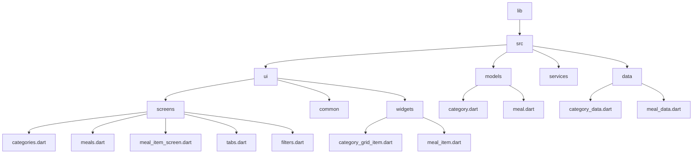

[<-- Part-04.md](https://github.com/PriyathamVarma/Learn-Flutter/blob/main/Meals-App/Part-04.md) | [Part 06 -->](https://github.com/PriyathamVarma/Learn-Flutter/blob/main/Meals-App/Part-06.md)


## Adding a filter item



> filters.dart

<details>
  <summary>Code</summary>

```dart
/* 
  This is the screen for 
  displaying filters
*/

// Imports

import 'package:flutter/material.dart';

class FiltersScreen extends StatefulWidget {
  const FiltersScreen({super.key});

  @override
  State<FiltersScreen> createState() {
    return _FiltersScreenState();
  }
}

// The return type of DiceRoll class

class _FiltersScreenState extends State<FiltersScreen> {
  var _glutenFreeFilterSet = false;

  @override
  Widget build(BuildContext context) {
    return Scaffold(
        appBar: AppBar(
          title: const Text("Title"),
        ),
        body: Column(
          children: [
            SwitchListTile(
                value: _glutenFreeFilterSet,
                onChanged: (isChecked) {
                  setState(() {
                    _glutenFreeFilterSet = isChecked;
                  });
                },
                title: const Text('Gluten')),
          ],
        ));
  }
}

```
  
</details>

> tabs.dart

<details>
  <summary>Code</summary>

```dart
/* 
  This is for tabs navigation
*/

// Imports

import "package:flutter/material.dart";
import "package:meals_app/src/models/meal.dart";
import "package:meals_app/src/ui/screens/categories.dart";
import "package:meals_app/src/ui/screens/filters.dart";
import "package:meals_app/src/ui/screens/meals.dart";
import "package:meals_app/src/ui/widgets/main_drawer.dart";

// Stateless

// Stateful

// Widget
class TabsScreen extends StatefulWidget {
  const TabsScreen({super.key});

  @override
  State<TabsScreen> createState() {
    return _TabsScreenState();
  }
}

// The return type of DiceRoll class

class _TabsScreenState extends State<TabsScreen> {
  int _selectedIndex = 0;
  final List<Meal> _favoriteMeals = [];

  // Functions for add/remove favorites
  void _toggleMealFavoriteStatus(Meal meal) {
    final isExisting = _favoriteMeals.contains(meal);

    if (isExisting) {
      setState(() {
        _favoriteMeals.remove(meal);
      });
    } else {
      setState(() {
        _favoriteMeals.add(meal);
      });
    }
  }

  void _selectedPage(int index) {
    setState(() {
      _selectedIndex = index;
    });
  }

  void _setScreen(String identifier) {
    if (identifier == 'filters') {
      Navigator.of(context).push(
        MaterialPageRoute(
          builder: (ctx) => const FiltersScreen(),
        ),
      );
    } else {
      Navigator.of(context).pop();
    }
  }

  @override
  Widget build(context) {
    Widget activeScreen = CategoriesScreen(
      onToggleFavorite: _toggleMealFavoriteStatus,
    );
    String activeScreenTitle = "Home";

    if (_selectedIndex == 1) {
      activeScreen = MealsScreen(
        title: "Category",
        meals: _favoriteMeals,
        onToggleFavorite: _toggleMealFavoriteStatus,
      );
      activeScreenTitle = "Category";
    } else if (_selectedIndex == 2) {
      activeScreen = MealsScreen(
        title: "Favorites",
        meals: _favoriteMeals,
        onToggleFavorite: _toggleMealFavoriteStatus,
      );
      activeScreenTitle = "Favorites";
    }
    return Scaffold(
      appBar: AppBar(
        title: Text(activeScreenTitle),
      ),
      drawer: DrawerWidget(onSelectScreen: _setScreen),
      body: activeScreen,
      bottomNavigationBar: BottomNavigationBar(
        onTap: (index) {
          _selectedPage(index);
        },
        currentIndex: _selectedIndex,
        items: const [
          BottomNavigationBarItem(icon: Icon(Icons.home), label: "Home"),
          BottomNavigationBarItem(
              icon: Icon(Icons.set_meal), label: "Category"),
          BottomNavigationBarItem(icon: Icon(Icons.star), label: "Favorites"),
        ],
      ),
    );
  }
}

```
  
</details>


<image src="https://github.com/PriyathamVarma/Learn-Flutter/blob/main/Images/Simulator%20Screenshot%20-%20Dice%20Test%20-%202024-01-14%20at%2022.36.01.png" width=200 height="auto" style="border:1px solid black"/>


<details>
  <summary>Code</summary>

```dart

```
  
</details>


[<-- Part-04.md](https://github.com/PriyathamVarma/Learn-Flutter/blob/main/Meals-App/Part-04.md) | [Part 06 -->](https://github.com/PriyathamVarma/Learn-Flutter/blob/main/Meals-App/Part-06.md)


