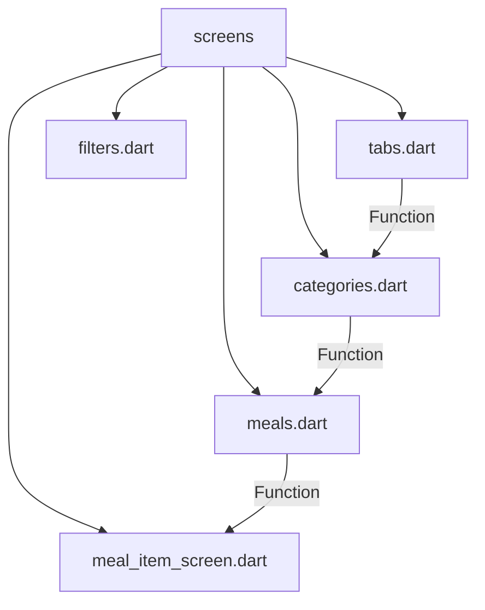

[<-- Part-05.md](https://github.com/PriyathamVarma/Learn-Flutter/blob/main/Meals-App/Part-05.md) | [Part 07 -->](https://github.com/PriyathamVarma/Learn-Flutter/blob/main/Meals-App/Part-07.md)


# App-wide state

- Using Library ~ Riverpod

**Problem**


* We have to pass the function through multiple widgets to get the data

  
**Solution**

- Using reactive library like `Riverpod`

### Installation

```cmd
flutter pub add riverpod
```


## Useful resources

1. [Riverpod](https://riverpod.dev/)


[<-- Part-05.md](https://github.com/PriyathamVarma/Learn-Flutter/blob/main/Meals-App/Part-05.md) | [Part 07 -->](https://github.com/PriyathamVarma/Learn-Flutter/blob/main/Meals-App/Part-07.md)
