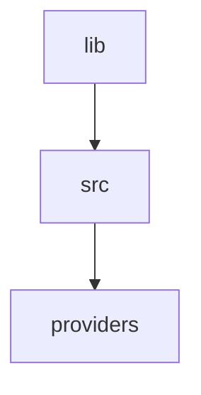
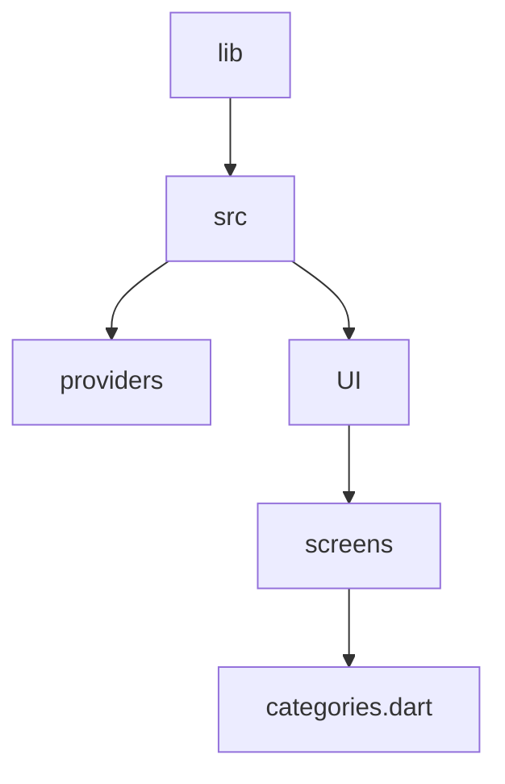
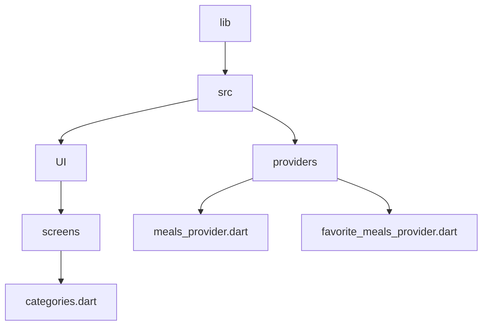
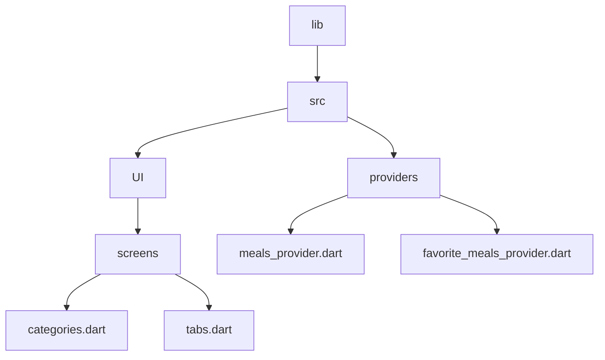

# State management using riverpod



**What is a Riverpod Provider?**

The Riverpod documentation defines a **Provider** as an object that encapsulates a piece of state and allows listening to that state.

With Riverpod, providers are the core of everything:

- They completely replace design patterns such as singletons, service locators, dependency injection, and InheritedWidgets.
- They allow you to store some state and easily access it in multiple locations.
- They allow you to optimize performance by filtering widget rebuilds or caching expensive state computations.
- They make your code more testable, since each provider can be overridden to behave differently during a test.

## Creating a provider

> providers/meals_providers.dart

<details>
  <summary>Code</summary>

```dart
/* 
  This is for meals provider
  object
*/
// Imports
import 'package:flutter_riverpod/flutter_riverpod.dart';
import 'package:meals_app/src/data/meal_data.dart';

final mealsprovider = Provider((ref) {
  return dummyMeals;
});


```  
</details>

## Using a provider

- Import `import 'package:flutter_riverpod/flutter_riverpod.dart';`
- Import providers to the file
- Change the `StatelessWidget` to `ConsumerWidget`
- If it is a `StatefulWidget`, then change that to `ConsumerStatefulWidget` and replace `State` with `ConsumerState`.
- After `Widget build(BuildContext build)` add `ref.watch(mealsProvider);`
- Add `WidgetRef ref` in the build method ~ ` Widget build(BuildContext context, WidgetRef ref) { `
- Use `final meals = ref.watch(mealsProvider);` so that we can use meals which is nothing but dumyMeals.
- - Wrap the main app with `ProviderScope`

> main.dart

```dart

// This is the main dart file
// IMPORTS
import 'package:flutter/material.dart';
import 'package:flutter_riverpod/flutter_riverpod.dart';
// Screens
import 'package:meals_app/src/ui/screens/tabs.dart';

void main() {
  runApp(
    ProviderScope(
      child: MaterialApp(
        theme: ThemeData().copyWith(
          scaffoldBackgroundColor: Colors.white,
          cardColor: Colors.amberAccent,
          // textTheme: GoogleFonts.latoTextTheme(),
        ),
        home: const TabsScreen(),
      ),
    ),
  );
}

```



> categories.dart  

<details>
  <summary>Code</summary>

```dart
/* 
  This file is for categories
  listing using Grid view List
*/

import 'package:flutter/material.dart';
import 'package:flutter_riverpod/flutter_riverpod.dart';
import 'package:meals_app/src/data/category_data.dart';
import 'package:meals_app/src/data/meal_data.dart';
import 'package:meals_app/src/models/category.dart';
import 'package:meals_app/src/models/meal.dart';
import 'package:meals_app/src/providers/meals_provider.dart';
import 'package:meals_app/src/ui/screens/meals.dart';
import 'package:meals_app/src/ui/widgets/category_grid_item.dart';

class CategoriesScreen extends ConsumerWidget {
  const CategoriesScreen({
    super.key,
    required this.onToggleFavorite,
  });

  final void Function(Meal meal) onToggleFavorite;

  void _selectCategory(BuildContext context, Category category) {
    final filteredMeals = dummyMeals
        .where(
          (meals) => meals.categories.contains(category.id),
        )
        .toList();

    Navigator.of(context).push(
      MaterialPageRoute(
        builder: (ctx) => MealsScreen(
            title: category.title,
            meals: filteredMeals,
            onToggleFavorite: onToggleFavorite),
      ),
    );
  }

  @override
  Widget build(BuildContext context, WidgetRef ref) {
    // We can now watch and get the data from providers
    final meals = ref.watch(mealsProvider);

    final availableMeals = meals;
    return Scaffold(
      appBar: AppBar(
        title: const Text("Pick Category"),
        actions: <Widget>[
          IconButton(
            icon: const Icon(Icons.add),
            onPressed: () {},
          ),
        ],
      ),
      body: GridView(
        padding: const EdgeInsets.all(24),
        gridDelegate: const SliverGridDelegateWithFixedCrossAxisCount(
            crossAxisCount: 2,
            childAspectRatio: 3 / 2,
            crossAxisSpacing: 10,
            mainAxisSpacing: 10),
        children: [
          for (final category in availableCategories)
            CategoryGridItem(
                category: category,
                onSelectcategory: () {
                  _selectCategory(context, category);
                })
        ],
      ),
    );
  }
}

```
  
</details>


### Eight different kinds of providers
So far, we have learned how to create a simple Provider and watch it inside a widget using a ref object.

But Riverpod offers eight different kinds of providers, all suited for separate use cases:

- `Provider`
- `StateProvider (legacy)`
- `StateNotifierProvider (legacy)`
- `FutureProvider`
- `StreamProvider`
- `ChangeNotifierProvider (legacy)`
- `NotifierProvider (new in Riverpod 2.0)`
- `AsyncNotifierProvider (new in Riverpod 2.0)`

## Complex provider with `StateNotifier`



> favorite_meals_provider.dart

<details>
  <summary>Code</summary>

> Adding the class

```dart
/*
  This provider is for favorite meals
*/
import 'package:flutter_riverpod/flutter_riverpod.dart';
import 'package:meals_app/src/models/meal.dart';

class FavoriteMealsNotifier extends StateNotifier<List<Meal>> {
  FavoriteMealsNotifier() : super([]);
}

final favoriteMealsProvider = StateNotifierProvider();

```

> Adding state and conditions

```dart
/*
  This provider is for favorite meals
*/
import 'package:flutter_riverpod/flutter_riverpod.dart';
import 'package:meals_app/src/models/meal.dart';

class FavoriteMealsNotifier extends StateNotifier<List<Meal>> {
  FavoriteMealsNotifier() : super([]);

  // Methods
  void toggleMealFavoriteStatus(Meal meal) {
    // Remember: We cant change the existing value in a memory
    // So, we cant use add/remove
    // We can use global state class
    final mealIsFavorite = state.contains(meal);

    // Condition for add/remove
    if (mealIsFavorite) {
      state = state.where((m) => m.id != meal.id).toList();
    } else {
      state = [...state, meal];
    }
  }
}

final favoriteMealsProvider = StateNotifierProvider();


```

> Adding the class to the notifier

```dart

/*
  This provider is for favorite meals
*/
import 'package:flutter_riverpod/flutter_riverpod.dart';
import 'package:meals_app/src/models/meal.dart';

class FavoriteMealsNotifier extends StateNotifier<List<Meal>> {
  FavoriteMealsNotifier() : super([]);

  // Methods
  void toggleMealFavoriteStatus(Meal meal) {
    // Remember: We cant change the existing value in a memory
    // So, we cant use add/remove
    // We can use global state class
    final mealIsFavorite = state.contains(meal);

    // Condition for add/remove
    if (mealIsFavorite) {
      state = state.where((m) => m.id != meal.id).toList();
    } else {
      state = [...state, meal];
    }
  }
}

final favoriteMealsProvider =
    StateNotifierProvider<FavoriteMealsNotifier, List<Meal>>((ref) {
  return FavoriteMealsNotifier();
});

```
  
</details>


## Using the FavoritesProvider




> tabs.dart

<details>
  <summary>Code</summary>

- Also, remove the toggle... in other screens as well
  

```dart
/* 
  This is for tabs navigation
*/

// Imports

import "package:flutter/material.dart";
import "package:flutter_riverpod/flutter_riverpod.dart";
import "package:meals_app/src/models/meal.dart";
import "package:meals_app/src/providers/favorite_meals_provider.dart";
import "package:meals_app/src/ui/screens/categories.dart";
import "package:meals_app/src/ui/screens/filters.dart";
import "package:meals_app/src/ui/screens/meals.dart";
import "package:meals_app/src/ui/widgets/main_drawer.dart";

// Stateless

// Stateful

// Widget
class TabsScreen extends ConsumerStatefulWidget {
  const TabsScreen({super.key});

  @override
  ConsumerState<TabsScreen> createState() {
    return _TabsScreenState();
  }
}

// The return type of DiceRoll class

class _TabsScreenState extends ConsumerState<TabsScreen> {
  int _selectedIndex = 0;
  // final List<Meal> _favoriteMeals = [];

  // Functions for add/remove favorites
  /*
  void _toggleMealFavoriteStatus(Meal meal) {
    final isExisting = _favoriteMeals.contains(meal);

    if (isExisting) {
      setState(() {
        _favoriteMeals.remove(meal);
      });
    } else {
      setState(() {
        _favoriteMeals.add(meal);
      });
    }
  }
  */

  void _selectedPage(int index) {
    setState(() {
      _selectedIndex = index;
    });
  }

  void _setScreen(String identifier) {
    if (identifier == 'filters') {
      Navigator.of(context).push(
        MaterialPageRoute(
          builder: (ctx) => const FiltersScreen(),
        ),
      );
    } else {
      Navigator.of(context).pop();
    }
  }

  @override
  Widget build(context) {
    Widget activeScreen = CategoriesScreen();
    String activeScreenTitle = "Home";

    if (_selectedIndex == 1) {
      final favoriteMeals = ref.watch(favoriteMealsProvider);
      activeScreen = MealsScreen(
        title: "Category",
        meals: favoriteMeals,
      );
      activeScreenTitle = "Category";
    } else if (_selectedIndex == 2) {
      final favoriteMeals = ref.watch(favoriteMealsProvider);
      activeScreen = MealsScreen(
        title: "Favorites",
        meals: favoriteMeals,
      );
      activeScreenTitle = "Favorites";
    }
    return Scaffold(
      appBar: AppBar(
        title: Text(activeScreenTitle),
      ),
      drawer: DrawerWidget(onSelectScreen: _setScreen),
      body: activeScreen,
      bottomNavigationBar: BottomNavigationBar(
        onTap: (index) {
          _selectedPage(index);
        },
        currentIndex: _selectedIndex,
        items: const [
          BottomNavigationBarItem(icon: Icon(Icons.home), label: "Home"),
          BottomNavigationBarItem(
              icon: Icon(Icons.set_meal), label: "Category"),
          BottomNavigationBarItem(icon: Icon(Icons.star), label: "Favorites"),
        ],
      ),
    );
  }
}

```
  
</details>

## Useful resources

1. [Riverpod uses](https://codewithandrea.com/articles/flutter-state-management-riverpod/)
