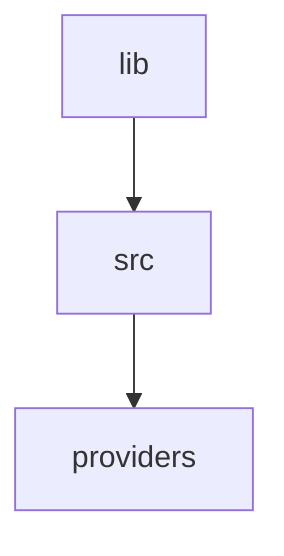
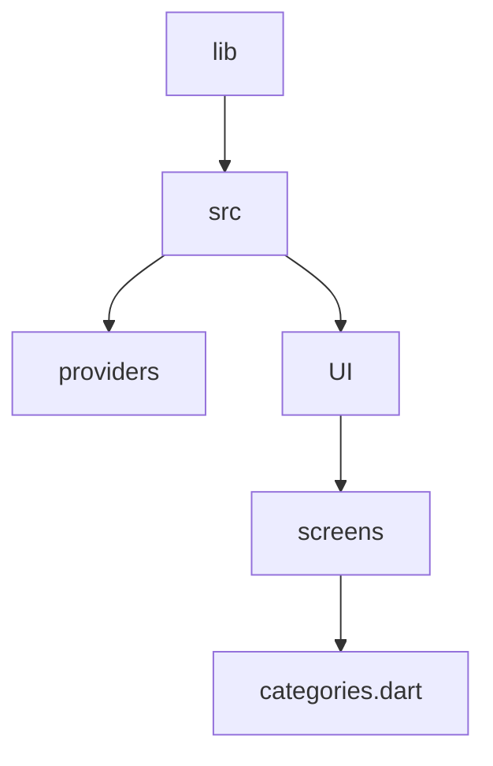

# State management using riverpod



**What is a Riverpod Provider?**

The Riverpod documentation defines a **Provider** as an object that encapsulates a piece of state and allows listening to that state.

With Riverpod, providers are the core of everything:

- They completely replace design patterns such as singletons, service locators, dependency injection, and InheritedWidgets.
- They allow you to store some state and easily access it in multiple locations.
- They allow you to optimize performance by filtering widget rebuilds or caching expensive state computations.
- They make your code more testable, since each provider can be overridden to behave differently during a test.

## Creating a provider

> providers/meals_providers.dart

<details>
  <summary>Code</summary>

```dart
/* 
  This is for meals provider
  object
*/
// Imports
import 'package:flutter_riverpod/flutter_riverpod.dart';
import 'package:meals_app/src/data/meal_data.dart';

final mealsprovider = Provider((ref) {
  return dummyMeals;
});


```  
</details>

## Using a provider

- Import `import 'package:flutter_riverpod/flutter_riverpod.dart';`
- Import providers to the file




> categories.dart  

<details>
  <summary>Code</summary>

```dart

```
  
</details>

## Useful resources

1. [Riverpod uses](https://codewithandrea.com/articles/flutter-state-management-riverpod/)
