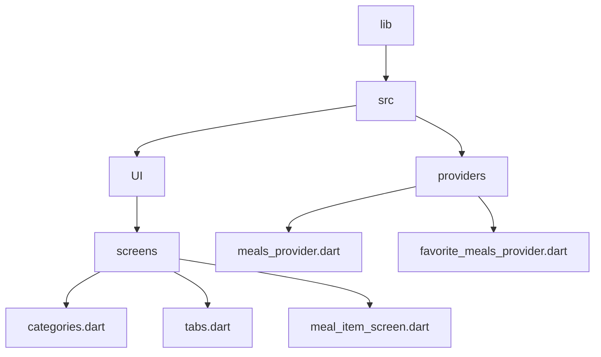

[<-- Part-07.md](https://github.com/PriyathamVarma/Learn-Flutter/blob/main/Meals-App/Part-07.md) | [README -->](https://github.com/PriyathamVarma/Learn-Flutter/blob/main/Meals-App/README.md)


## Trigger a notifier method




> screens/meal_item_screen.dart

<details>
  <summary>Code</summary>

```dart

/*
  This file is for meal
  item screen
*/
// Imports

// import 'package:flutter/foundation.dart';
import 'package:flutter/material.dart';
import 'package:meals_app/src/models/meal.dart';
import 'package:flutter_riverpod/flutter_riverpod.dart';
import 'package:meals_app/src/providers/favorite_meals_provider.dart';

class MealItemScreen extends ConsumerWidget {
  const MealItemScreen({
    super.key,
    required this.mealData,
  });

  final Meal mealData;

  @override
  Widget build(BuildContext context, WidgetRef ref) {
    return Scaffold(
      appBar: AppBar(
        title: Text(mealData.title),
        actions: [
          IconButton(
            icon: const Icon(Icons.star),
            onPressed: () {
              ref
                  .read(favoriteMealsProvider.notifier)
                  .toggleMealFavoriteStatus(mealData);
            },
          ),
        ],
      ),
      body: SingleChildScrollView(
        child: Column(
          children: [
            SizedBox(
              height: 300,
              width: double.infinity,
              child: Image.network(mealData.imageUrl),
            ),
            Padding(
              padding: const EdgeInsets.all(16.0),
              child: Column(
                crossAxisAlignment: CrossAxisAlignment.start,
                children: [
                  Text(
                    'Categories: ${mealData.categories.join(', ')}',
                    style: const TextStyle(fontSize: 16),
                  ),
                  const Text(
                    'Ingredients:',
                    style: TextStyle(fontSize: 18, fontWeight: FontWeight.bold),
                  ),
                  const SizedBox(height: 8),
                  // Display ingredients in a list
                  ListView.builder(
                    shrinkWrap: true,
                    itemCount: mealData.ingredients.length,
                    itemBuilder: (context, index) => Padding(
                      padding: const EdgeInsets.symmetric(vertical: 4),
                      child: Text(
                        '- ${mealData.ingredients[index]}',
                      ),
                    ),
                  ),
                  // ... Display other data fields similarly ...
                  const Divider(),
                  const Text(
                    'Steps:',
                    style: TextStyle(fontSize: 18, fontWeight: FontWeight.bold),
                  ),
                  const SizedBox(height: 8),

                  // Display ingredients in a list
                  ListView.builder(
                    shrinkWrap: true,
                    itemCount: mealData.steps.length,
                    itemBuilder: (context, index) => Padding(
                      padding: const EdgeInsets.symmetric(vertical: 4),
                      child: Text(
                        '- ${mealData.steps[index]}',
                      ),
                    ),
                  ),
                  // ... Display duration, complexity, affordability, dietary info ...
                ],
              ),
            ),
          ],
        ),
      ),
    );
  }
}


```
  
</details>


[<-- Part-07.md](https://github.com/PriyathamVarma/Learn-Flutter/blob/main/Meals-App/Part-07.md) | [README -->](https://github.com/PriyathamVarma/Learn-Flutter/blob/main/Meals-App/README.md)
