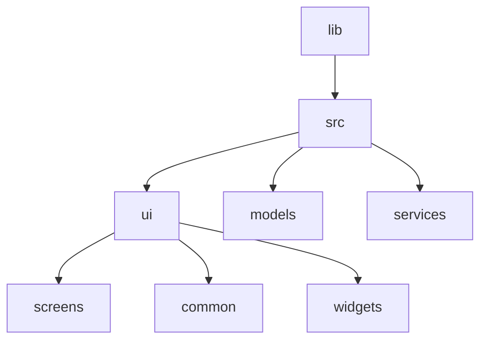

# Meals App

## Project Structure



> main.dart

<details>
  <summary>Code</summary>

```dart
// This is the main dart file
// IMPORTS
import 'package:flutter/material.dart';
// Screens
import 'package:meals_app/src/ui/screens/categories.dart';

void main() {
  runApp(
    MaterialApp(
      theme: ThemeData().copyWith(
        scaffoldBackgroundColor: const Color.fromARGB(255, 255, 94, 7),
        cardColor: Colors.amberAccent,
        // textTheme: GoogleFonts.latoTextTheme(),
      ),
      home: const CategoriesScreen(),
    ),
  );
}

```  
</details>

* Create a file in `screens/categories.dart`

<details>
  <summary>Code</summary>

```dart

```  
</details>
