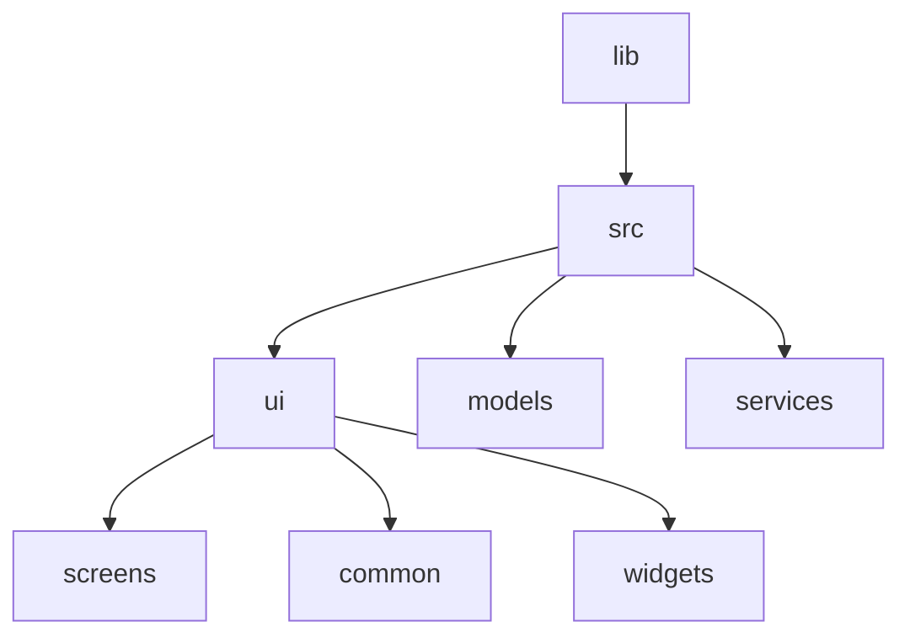
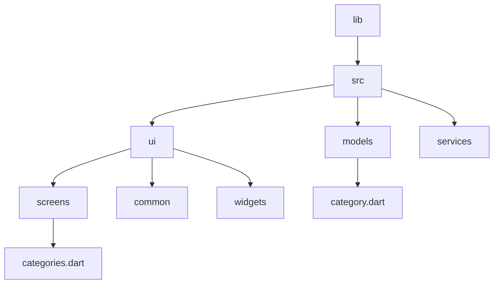
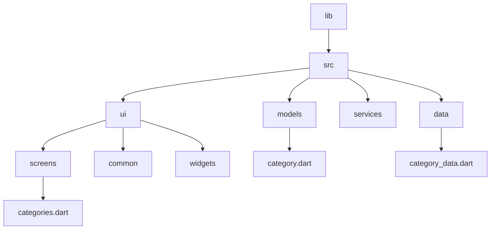

# Meals App

## Project Structure



> main.dart

<details>
  <summary>Code</summary>

```dart
// This is the main dart file
// IMPORTS
import 'package:flutter/material.dart';
// Screens
import 'package:meals_app/src/ui/screens/categories.dart';

void main() {
  runApp(
    MaterialApp(
      theme: ThemeData().copyWith(
        scaffoldBackgroundColor: const Color.fromARGB(255, 255, 94, 7),
        cardColor: Colors.amberAccent,
        // textTheme: GoogleFonts.latoTextTheme(),
      ),
      home: const CategoriesScreen(),
    ),
  );
}

```  
</details>

* Create a file in `screens/categories.dart`

> categories.dart

* This contains `GridView`
  

<details>
  <summary>Code</summary>

```dart
/* 
  This file is for categories
  listing using Grid view List
*/

import 'package:flutter/material.dart';

class CategoriesScreen extends StatelessWidget {
  const CategoriesScreen({super.key});
  void onPressed() => {
        debugPrint("Image changing..."),
      };

  @override
  Widget build(BuildContext context) {
    return Scaffold(
      appBar: AppBar(
        title: const Text("Pick Category"),
        actions: <Widget>[
          IconButton(
            icon: const Icon(Icons.add),
            tooltip: 'Show Snackbar',
            onPressed: () {
              ScaffoldMessenger.of(context).showSnackBar(
                  const SnackBar(content: Text('This is a snackbar')));
            },
          ),
        ],
      ),
      body: GridView(
        gridDelegate: const SliverGridDelegateWithFixedCrossAxisCount(
            crossAxisCount: 2,
            childAspectRatio: 3 / 2,
            crossAxisSpacing: 20,
            mainAxisSpacing: 20),
        children: const [Text("1"), Text('2'), Text('3'), Text('4')],
      ),
    );
  }
}

```  
</details>

* Create a new file in the models folder ~ `category.dart`



> Category.dart
  
<details>
  <summary>Code</summary>

```dart
/*
  This is the model for 
  category
*/

import 'package:flutter/material.dart';

class Category {
  Category({required this.id, required this.title, this.color = Colors.black});
  final String id;
  final String title;
  final Color color;
}

```
  
</details>


* Now, you can enter a dummy data




> category_data.dart

<details>
  <summary>Code</summary>

```dart
/* 
  This is the dummy data
  for categories
*/

import 'package:meals_app/src/models/category.dart';
import 'package:flutter/material.dart';

const availableCategories = [
  Category(
    id: 'c1',
    title: 'Italian',
    color: Colors.purple,
  ),
  Category(
    id: 'c2',
    title: 'Quick & Easy',
    color: Colors.red,
  ),
  Category(
    id: 'c3',
    title: 'Hamburgers',
    color: Colors.orange,
  ),
  Category(
    id: 'c4',
    title: 'German',
    color: Colors.amber,
  ),
  Category(
    id: 'c5',
    title: 'Light & Lovely',
    color: Colors.blue,
  ),
  Category(
    id: 'c6',
    title: 'Exotic',
    color: Colors.green,
  ),
  Category(
    id: 'c7',
    title: 'Breakfast',
    color: Colors.lightBlue,
  ),
  Category(
    id: 'c8',
    title: 'Asian',
    color: Colors.lightGreen,
  ),
  Category(
    id: 'c9',
    title: 'French',
    color: Colors.pink,
  ),
  Category(
    id: 'c10',
    title: 'Summer',
    color: Colors.teal,
  ),
];

```
  
</details>

* Now, create a widget `ui/widgets/category_grid_item.dart`


<details>
  <summary>Code</summary>

```dart

```
  
</details>

