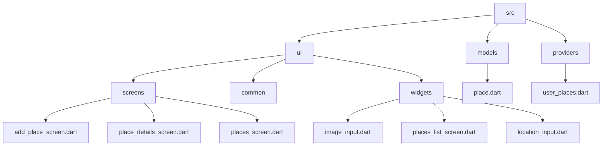

[<-- Readme](https://github.com/PriyathamVarma/Learn-Flutter/blob/main/Native-App/README.md) | [Part 02 -->](https://github.com/PriyathamVarma/Learn-Flutter/blob/main/Native-App/Part-02.md)




## Previewing the picked Image

> places_list_screen.dart

<details>
  <summary>Code</summary>

```dart

import 'package:flutter/material.dart';

import 'package:native_app/src/models/place.dart';
import 'package:native_app/src/ui/screens/place_details_screen.dart';

class PlacesList extends StatelessWidget {
  const PlacesList({super.key, required this.places});

  final List<Place> places;

  @override
  Widget build(BuildContext context) {
    if (places.isEmpty) {
      return Center(
        child: Text(
          'No places added yet',
          style: Theme.of(context).textTheme.bodyLarge!.copyWith(
                color: Theme.of(context).colorScheme.onBackground,
              ),
        ),
      );
    }

    return ListView.builder(
      itemCount: places.length,
      itemBuilder: (ctx, index) => ListTile(
        leading: CircleAvatar(
          radius: 26,
          backgroundImage: FileImage(places[index].image),
        ),
        title: Text(
          places[index].title,
          style: Theme.of(context).textTheme.titleMedium!.copyWith(
                color: Theme.of(context).colorScheme.onBackground,
              ),
        ),
        onTap: () {
          Navigator.of(context).push(
            MaterialPageRoute(
              builder: (ctx) => PlaceDetailScreen(place: places[index]),
            ),
          );
        },
      ),
    );
  }
}


```
  
</details>

## Adding the location package & starting with get location

- Add `flutter pub add location`
- Use `NSLocationWhenInUseUsageDescription` in the ios/Runner/info.plist

```
<key>NSLocationWhenInUseUsageDescription</key>
	<string>Your Location</string>
```
 - Create a file > widgets/location_input.dart


<details>
  <summary>Code</summary>

```dart

import 'package:flutter/material.dart';

class LocationInput extends StatefulWidget {
  const LocationInput({super.key});

  @override
  State<LocationInput> createState() {
    return _LocationInputState();
  }
}

class _LocationInputState extends State<LocationInput> {
  @override
  Widget build(BuildContext context) {
    return Column(
      children: [
        Container(
          height: 170,
          width: double.infinity,
          alignment: Alignment.center,
          decoration: BoxDecoration(
            border: Border.all(
              width: 1,
              color: Theme.of(context).colorScheme.primary.withOpacity(0.2),
            ),
          ),
          child: Text(
            'No location chosen',
            textAlign: TextAlign.center,
            style: Theme.of(context).textTheme.bodyLarge!.copyWith(
                  color: Theme.of(context).colorScheme.onBackground,
                ),
          ),
        ),
        Row(
          mainAxisAlignment: MainAxisAlignment.spaceEvenly,
          children: [
            TextButton.icon(
              icon: const Icon(Icons.location_on),
              label: const Text('Get Current Location'),
              onPressed: () {},
            ),
            TextButton.icon(
              icon: const Icon(Icons.map),
              label: const Text('Select on Map'),
              onPressed: () {},
            ),
          ],
        ),
      ],
    );
  }
}

```
  
</details>


<details>
  <summary>Code</summary>

```dart


```
  
</details>


## Resources

1.[Location Package](https://pub.dev/packages/location)


[<-- Readme](https://github.com/PriyathamVarma/Learn-Flutter/blob/main/Native-App/README.md) | [Part 02 -->](https://github.com/PriyathamVarma/Learn-Flutter/blob/main/Native-App/Part-02.md)
