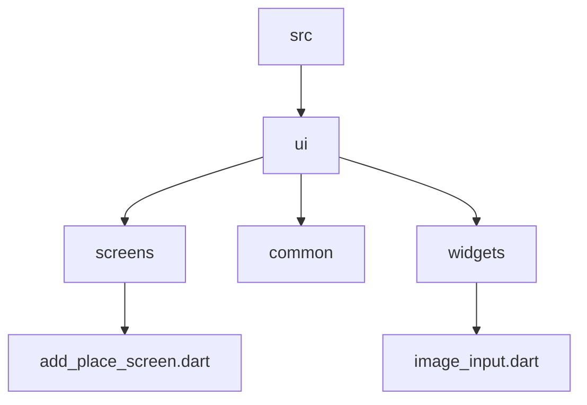

# Native App

* How to use camera
* How to use Native Location
* Using Google maps
* Storing data on device


## Create the necessary project structure

Here is the project [link]()

## Adding a Pick an Image input



> image_input.dart

<details>
  <summary>Code</summary>

```dart

import 'package:flutter/material.dart';

class ImageInput extends StatefulWidget {
  const ImageInput({super.key});

  @override
  State<StatefulWidget> createState() {
    return _ImageInputState();
  }
}

class _ImageInputState extends State<ImageInput> {
  @override
  Widget build(BuildContext build) {
    return Container(
      height: 250,
      width: double.infinity,
      alignment: Alignment.center,
      child: TextButton.icon(
        onPressed: () {},
        icon: const Icon(Icons.camera),
        label: const Text("take Image"),
      ),
    );
  }
}


```
  
</details>

> add_place_screen.dart


<details>
  <summary>Code</summary>

```dart

import 'package:flutter/material.dart';
import 'package:flutter_riverpod/flutter_riverpod.dart';
import 'package:native_app/src/providers/user_places.dart';
import 'package:native_app/src/ui/widgets/image_input.dart';

class AddPlaceScreen extends ConsumerStatefulWidget {
  const AddPlaceScreen({super.key});

  @override
  ConsumerState<AddPlaceScreen> createState() {
    return _AddPlaceScreenState();
  }
}

class _AddPlaceScreenState extends ConsumerState<AddPlaceScreen> {
  final _titleController = TextEditingController();

  void _savePlace() {
    final enteredTitle = _titleController.text;

    if (enteredTitle.isEmpty) {
      return;
    }

    ref.read(userPlacesProvider.notifier).addPlace(enteredTitle);

    Navigator.of(context).pop();
  }

  @override
  void dispose() {
    _titleController.dispose();
    super.dispose();
  }

  @override
  Widget build(BuildContext context) {
    return Scaffold(
      appBar: AppBar(
        title: const Text('Add new Place'),
      ),
      body: SingleChildScrollView(
        padding: const EdgeInsets.all(12),
        child: Column(
          children: [
            TextField(
              decoration: const InputDecoration(labelText: 'Title'),
              controller: _titleController,
              style: TextStyle(
                color: Theme.of(context).colorScheme.onBackground,
              ),
            ),
            // Image Input Field
            const ImageInput(),
            const SizedBox(height: 16),
            ElevatedButton.icon(
              onPressed: _savePlace,
              icon: const Icon(Icons.add),
              label: const Text('Add Place'),
            ),
          ],
        ),
      ),
    );
  }
}


```
  
</details>


<details>
  <summary>Code</summary>

```dart

```
  
</details>
