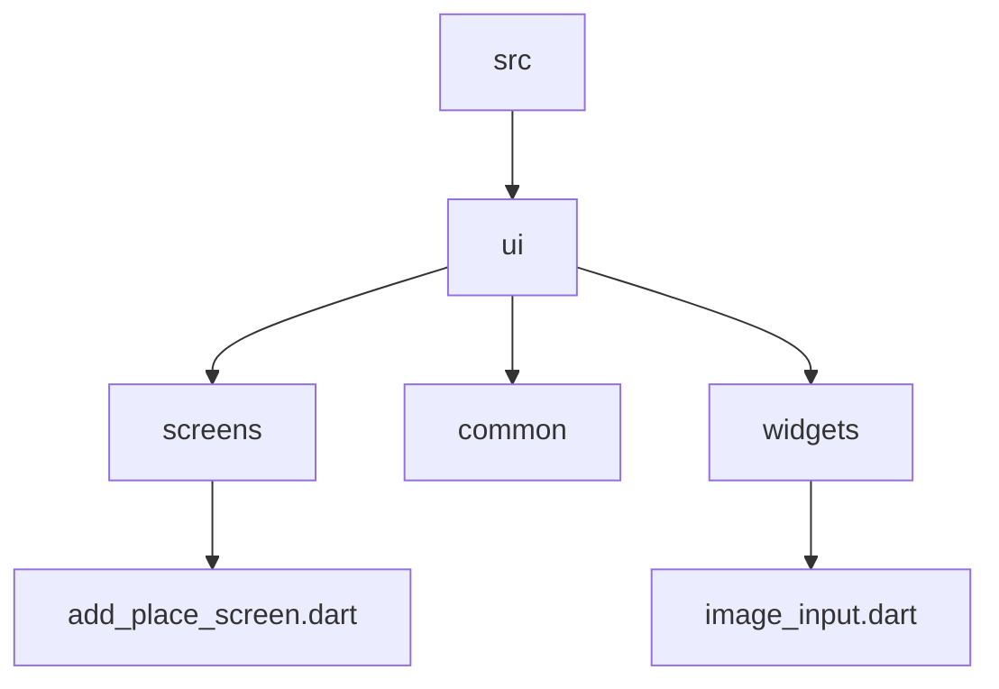

[Part 01 -->](https://github.com/PriyathamVarma/Learn-Flutter/blob/main/Native-App/Part-01.md)

# Native App

* How to use camera
* How to use Native Location
* Using Google maps
* Storing data on device


## Create the necessary project structure

Here is the project [link]()

## Adding a Pick an Image input



> image_input.dart

<details>
  <summary>Code</summary>

```dart

import 'dart:io';

import 'package:flutter/material.dart';
import 'package:image_picker/image_picker.dart';

class ImageInput extends StatefulWidget {
  const ImageInput({super.key});

  @override
  State<StatefulWidget> createState() {
    return _ImageInputState();
  }
}

class _ImageInputState extends State<ImageInput> {
  File? _selectedImage;
  void _takePicture() async {
    final imagePicker = ImagePicker();
    final pickedImage =
        await imagePicker.pickImage(source: ImageSource.camera, maxWidth: 600);

    if (pickedImage == null) {
      return;
    }
    setState(() {
      _selectedImage = File(pickedImage.path);
    });
  }

  @override
  Widget build(BuildContext build) {
    Widget content = TextButton.icon(
      onPressed: _takePicture,
      icon: const Icon(Icons.camera),
      label: const Text("take Image"),
    );

    if (_selectedImage != null) {
      content = Image.file(
        _selectedImage!,
        fit: BoxFit.cover,
      );
    }
    return Container(
      decoration: BoxDecoration(
        border: Border.all(width: 1, color: Colors.black),
      ),
      height: 250,
      width: double.infinity,
      alignment: Alignment.center,
      child: content,
    );
  }
}


```
  
</details>

> add_place_screen.dart


<details>
  <summary>Code</summary>

```dart

import 'package:flutter/material.dart';
import 'package:flutter_riverpod/flutter_riverpod.dart';
import 'package:native_app/src/providers/user_places.dart';
import 'package:native_app/src/ui/widgets/image_input.dart';

class AddPlaceScreen extends ConsumerStatefulWidget {
  const AddPlaceScreen({super.key});

  @override
  ConsumerState<AddPlaceScreen> createState() {
    return _AddPlaceScreenState();
  }
}

class _AddPlaceScreenState extends ConsumerState<AddPlaceScreen> {
  final _titleController = TextEditingController();

  void _savePlace() {
    final enteredTitle = _titleController.text;

    if (enteredTitle.isEmpty) {
      return;
    }

    ref.read(userPlacesProvider.notifier).addPlace(enteredTitle);

    Navigator.of(context).pop();
  }

  @override
  void dispose() {
    _titleController.dispose();
    super.dispose();
  }

  @override
  Widget build(BuildContext context) {
    return Scaffold(
      appBar: AppBar(
        title: const Text('Add new Place'),
      ),
      body: SingleChildScrollView(
        padding: const EdgeInsets.all(12),
        child: Column(
          children: [
            TextField(
              decoration: const InputDecoration(labelText: 'Title'),
              controller: _titleController,
              style: TextStyle(
                color: Theme.of(context).colorScheme.onBackground,
              ),
            ),
            const SizedBox(height: 16),
            // Image Input Field
            const ImageInput(),
            const SizedBox(height: 16),
            ElevatedButton.icon(
              onPressed: _savePlace,
              icon: const Icon(Icons.add),
              label: const Text('Add Place'),
            ),
          ],
        ),
      ),
    );
  }
}


```
  
</details>


## Adding the picked image to the model


> models/place.dart

<details>
  <summary>Code</summary>

```dart

import 'dart:io';

import 'package:uuid/uuid.dart';

const uuid = Uuid();

class Place {
  Place({required this.title, required this.image}) : id = uuid.v4();

  final String id;
  final String title;
  // Image
  final File image;
}


```
  
</details>


> providers/user_places.dart

<details>
  <summary>Code</summary>

```dart

import 'dart:io';

import 'package:flutter_riverpod/flutter_riverpod.dart';
import 'package:native_app/src/models/place.dart';

class UserPlacesNotifier extends StateNotifier<List<Place>> {
  UserPlacesNotifier() : super(const []);

  void addPlace(String title, File image) {
    final newPlace = Place(title: title, image: image);
    state = [newPlace, ...state];
  }
}

final userPlacesProvider =
    StateNotifierProvider<UserPlacesNotifier, List<Place>>(
  (ref) => UserPlacesNotifier(),
);


```
  
</details>


> add_place_screen.dart

<details>
  <summary>Code</summary>

```dart

import 'dart:io';

import 'package:flutter/material.dart';
import 'package:flutter_riverpod/flutter_riverpod.dart';
import 'package:native_app/src/providers/user_places.dart';
import 'package:native_app/src/ui/widgets/image_input.dart';

class AddPlaceScreen extends ConsumerStatefulWidget {
  const AddPlaceScreen({super.key});

  @override
  ConsumerState<AddPlaceScreen> createState() {
    return _AddPlaceScreenState();
  }
}

class _AddPlaceScreenState extends ConsumerState<AddPlaceScreen> {
  final _titleController = TextEditingController();
  File? _selectedImage;

  void _savePlace() {
    final enteredTitle = _titleController.text;

    if (enteredTitle.isEmpty) {
      return;
    }

    ref
        .read(userPlacesProvider.notifier)
        .addPlace(enteredTitle, _selectedImage!);

    Navigator.of(context).pop();
  }

  @override
  void dispose() {
    _titleController.dispose();
    super.dispose();
  }

  @override
  Widget build(BuildContext context) {
    return Scaffold(
      appBar: AppBar(
        title: const Text('Add new Place'),
      ),
      body: SingleChildScrollView(
        padding: const EdgeInsets.all(12),
        child: Column(
          children: [
            TextField(
              decoration: const InputDecoration(labelText: 'Title'),
              controller: _titleController,
              style: TextStyle(
                color: Theme.of(context).colorScheme.onBackground,
              ),
            ),
            const SizedBox(height: 16),
            // Image Input Field
            ImageInput(
              onTapImage: (File image) {
                _selectedImage = image;
              },
            ),
            const SizedBox(height: 16),
            ElevatedButton.icon(
              onPressed: _savePlace,
              icon: const Icon(Icons.add),
              label: const Text('Add Place'),
            ),
          ],
        ),
      ),
    );
  }
}


```
  
</details>

> image_input.dart


<details>
  <summary>Code</summary>

```dart

import 'dart:io';

import 'package:flutter/material.dart';
import 'package:image_picker/image_picker.dart';

class ImageInput extends StatefulWidget {
  const ImageInput({super.key, required this.onTapImage});

  // Function for sending the image to the parent widget
  final void Function(File image) onTapImage;

  @override
  State<StatefulWidget> createState() {
    return _ImageInputState();
  }
}

class _ImageInputState extends State<ImageInput> {
  File? _selectedImage;
  void _takePicture() async {
    final imagePicker = ImagePicker();
    final pickedImage =
        await imagePicker.pickImage(source: ImageSource.camera, maxWidth: 600);

    if (pickedImage == null) {
      return;
    }
    setState(() {
      _selectedImage = File(pickedImage.path);
    });

    widget.onTapImage(_selectedImage!);
  }

  @override
  Widget build(BuildContext build) {
    Widget content = TextButton.icon(
      onPressed: _takePicture,
      icon: const Icon(Icons.camera),
      label: const Text("take Image"),
    );

    if (_selectedImage != null) {
      content = GestureDetector(
        onTap: _takePicture,
        child: Image.file(
          _selectedImage!,
          fit: BoxFit.cover,
          width: double.infinity,
          height: double.infinity,
        ),
      );
    }
    return Container(
      decoration: BoxDecoration(
        border: Border.all(width: 1, color: Colors.black),
      ),
      height: 250,
      width: double.infinity,
      alignment: Alignment.center,
      child: content,
    );
  }
}


```
  
</details>


[Part 01 -->](https://github.com/PriyathamVarma/Learn-Flutter/blob/main/Native-App/Part-01.md)
