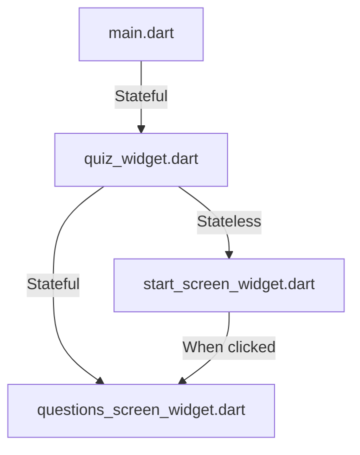

[<-- README.md](https://github.com/PriyathamVarma/Learn-Flutter/blob/main/Quiz-App/README.md) | [Part 02 -->](https://github.com/PriyathamVarma/Learn-Flutter/blob/main/Quiz-App/Part-02.md)

# Part 01

## Icons for Buttons

```dart
/* This is the starting
   screen widget
*/

// Imports
// Packages
// import 'dart:math';

import 'package:flutter/material.dart';

// Widgets
// Stateless

// Stateful

// Class
class StartScreen extends StatelessWidget {
  // Constructor
  const StartScreen({super.key});

  // void onPressed() => {
  //       debugPrint("BUtton Clicked"),
  //     };

  @override
  Widget build(context) {
    return Container(
        decoration: const BoxDecoration(
          gradient: LinearGradient(
            begin: Alignment.topLeft,
            end: Alignment(0.8, 1),
            colors: <Color>[
              Color(0xff1f005c),
              Color(0xff5b0060),
              Color(0xff870160),
              Color(0xffac255e),
              Color(0xffca485c),
              Color(0xffe16b5c),
              Color(0xfff39060),
              Color(0xffffb56b),
            ], // Gradient from https://learnui.design/tools/gradient-generator.html
            tileMode: TileMode.mirror,
          ),
        ),
        child: Column(
          mainAxisAlignment:
              MainAxisAlignment.center, // Center children vertically
          children: [
            Image.asset("assets/images/Quiz-Logo.png"),
            const Center(
              child: Text(
                'Quiz App',
                style: TextStyle(fontSize: 24, color: Colors.white),
              ),
            ),
            OutlinedButton.icon(
              //onPressed: onPressed,
              onPressed: () {
                debugPrint("clicked");
              },
              style: OutlinedButton.styleFrom(
                foregroundColor: Colors.white,
                side: const BorderSide(color: Colors.white),
                disabledForegroundColor:
                    Colors.black.withOpacity(0.38), // Set text color to black
              ),
              icon: const Icon(Icons.arrow_right_alt),
              label: const Text(
                "Click here",
                selectionColor: Colors.black,
              ),
            ),
          ],
        ));
  }
}
```


## Rendering Widgets conditionally

- First organise the widgets




[<-- README.md](https://github.com/PriyathamVarma/Learn-Flutter/blob/main/Quiz-App/README.md) | [Part 02 -->](https://github.com/PriyathamVarma/Learn-Flutter/blob/main/Quiz-App/Part-02.md)
