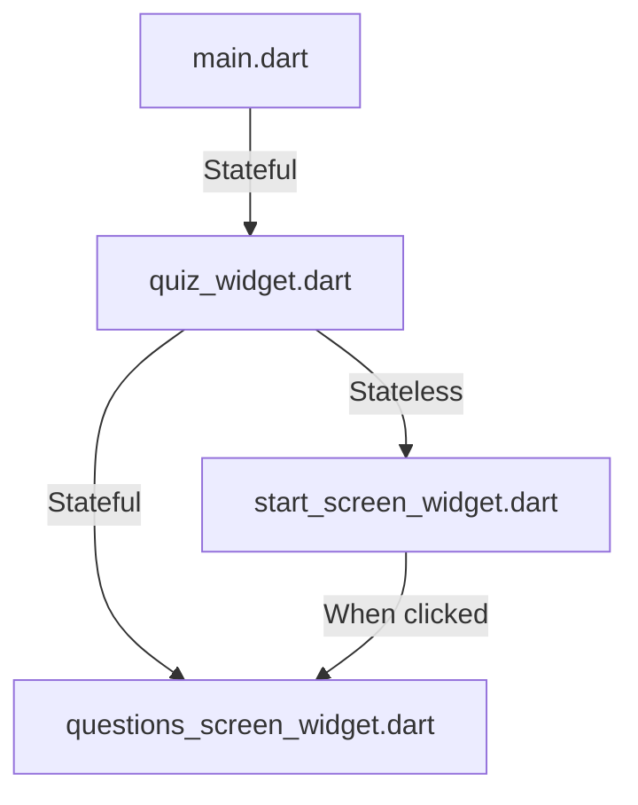

[<-- README.md](https://github.com/PriyathamVarma/Learn-Flutter/blob/main/Quiz-App/README.md) | [Part 02 -->](https://github.com/PriyathamVarma/Learn-Flutter/blob/main/Quiz-App/Part-02.md)

# Part 01

## Icons for Buttons

<details>

<summary>Code</summary>

```dart
/* This is the starting
   screen widget
*/

// Imports
// Packages
// import 'dart:math';

import 'package:flutter/material.dart';

// Widgets
// Stateless

// Stateful

// Class
class StartScreen extends StatelessWidget {
  // Constructor
  const StartScreen({super.key});

  // void onPressed() => {
  //       debugPrint("BUtton Clicked"),
  //     };

  @override
  Widget build(context) {
    return Container(
        decoration: const BoxDecoration(
          gradient: LinearGradient(
            begin: Alignment.topLeft,
            end: Alignment(0.8, 1),
            colors: <Color>[
              Color(0xff1f005c),
              Color(0xff5b0060),
              Color(0xff870160),
              Color(0xffac255e),
              Color(0xffca485c),
              Color(0xffe16b5c),
              Color(0xfff39060),
              Color(0xffffb56b),
            ], // Gradient from https://learnui.design/tools/gradient-generator.html
            tileMode: TileMode.mirror,
          ),
        ),
        child: Column(
          mainAxisAlignment:
              MainAxisAlignment.center, // Center children vertically
          children: [
            Image.asset("assets/images/Quiz-Logo.png"),
            const Center(
              child: Text(
                'Quiz App',
                style: TextStyle(fontSize: 24, color: Colors.white),
              ),
            ),
            OutlinedButton.icon(
              //onPressed: onPressed,
              onPressed: () {
                debugPrint("clicked");
              },
              style: OutlinedButton.styleFrom(
                foregroundColor: Colors.white,
                side: const BorderSide(color: Colors.white),
                disabledForegroundColor:
                    Colors.black.withOpacity(0.38), // Set text color to black
              ),
              icon: const Icon(Icons.arrow_right_alt),
              label: const Text(
                "Click here",
                selectionColor: Colors.black,
              ),
            ),
          ],
        ));
  }
}
```

</details>


## Rendering Widgets conditionally

- First organise the widgets



### Codes

<details>

   <summary>main.dart</summary>

   ```dart
/*
  This is the main file to run the 
  project.
*/

// Imports
// Packages
import 'package:flutter/material.dart';

// Widgets
// Stateless
// import 'package:quiz_app/stateless_widgets/layout_widgets/start_screen_widget.dart';
import 'package:quiz_app/stateful_widgets/quiz_widget.dart';
// Stateful

void main() {
  runApp(
    const QuizWidget(),
  );
}

```

</details>


<details>
   <summary>quiz.dart</summary>

```dart
/* This is the widget
   for  quiz 
*/

/* This is the widget for questions
*/

// Imports
// Packages
import "package:flutter/material.dart";
// Stateless
import 'package:quiz_app/stateless_widgets/layout_widgets/start_screen_widget.dart';
// Stateful
import 'package:quiz_app/stateful_widgets/questions_screen_widget.dart';

// Widget
class QuizWidget extends StatefulWidget {
  const QuizWidget({super.key});

  @override
  State<QuizWidget> createState() {
    return _QuizWidgetState();
  }
}

// The return type of DiceRoll class

class _QuizWidgetState extends State<QuizWidget> {
  Widget? activeScreen; // Pass the pointer

  // initState
  @override
  void initState() {
    activeScreen = StartScreen(switchScreen);
    super.initState();
  }

  void switchScreen() {
    setState(() {
      activeScreen = const QuestionsWidget();
    });
  }

  @override
  Widget build(context) {
    return MaterialApp(
      home: Scaffold(
        body: Container(
          decoration: const BoxDecoration(
            gradient: LinearGradient(
              begin: Alignment.topLeft,
              end: Alignment(0.8, 1),
              colors: <Color>[
                Color(0xff1f005c),
                Color(0xff5b0060),
                Color(0xff870160),
                Color(0xffac255e),
                Color(0xffca485c),
                Color(0xffe16b5c),
                Color(0xfff39060),
                Color(0xffffb56b),
              ], // Gradient from https://learnui.design/tools/gradient-generator.html
              tileMode: TileMode.mirror,
            ),
          ),
          child: activeScreen,
        ),
      ),
    );
  }
}

```
</details>


<details>

<summary>start_screen_widget.dart</summary> 

```dart
/* This is the starting
   screen widget
*/

// Imports
// Packages
// import 'dart:math';

import 'package:flutter/material.dart';

// Widgets
// Stateless

// Stateful
// import 'package:quiz_app/stateful_widgets/questions_screen_widget.dart';

// Class
class StartScreen extends StatelessWidget {
  // Constructor
  const StartScreen(this.startQuiz, {super.key});

  final void Function() startQuiz;

  void onPressed() => {
        startQuiz(),
      };

  @override
  Widget build(context) {
    return Column(
      mainAxisAlignment: MainAxisAlignment.center, // Center children vertically
      children: [
        Image.asset("assets/images/Quiz-Logo.png"),
        const Center(
          child: Text(
            'Quiz App',
            style: TextStyle(fontSize: 24, color: Colors.white),
          ),
        ),
        OutlinedButton.icon(
          //onPressed: onPressed,
          onPressed: onPressed,
          style: OutlinedButton.styleFrom(
            foregroundColor: Colors.white,
            side: const BorderSide(color: Colors.white),
            disabledForegroundColor:
                Colors.black.withOpacity(0.38), // Set text color to black
          ),
          icon: const Icon(Icons.arrow_right_alt),
          label: const Text(
            "Start Screenz",
            selectionColor: Colors.black,
          ),
        ),
      ],
    );
  }
}

```
</details>

<details>
<summary>questions_screen_widget.dart</summary> 

```dart
/* This is the widget for questions
*/

// Imports
// Packages
import "dart:math";

import "package:flutter/material.dart";

// Widget
class QuestionsWidget extends StatefulWidget {
  const QuestionsWidget({super.key});

  @override
  State<QuestionsWidget> createState() {
    return _QuestionsWidgetState();
  }
}

// The return type of DiceRoll class

class _QuestionsWidgetState extends State<QuestionsWidget> {
  var diceRollNumber = 1;

  void onPressed() => {
        // To change the state
        setState(() {
          // Create a Random instance to use its methods
          var random = Random();
          diceRollNumber = random.nextInt(6) + 1;
        }),
        debugPrint("Random number is $diceRollNumber"),
      };

  @override
  Widget build(context) {
    return Column(
      mainAxisAlignment: MainAxisAlignment.center, // Center children vertically
      children: [
        Image.asset("assets/images/Quiz-Logo.png"),
        const Center(
          child: Text(
            'Quiz App',
            style: TextStyle(fontSize: 24, color: Colors.white),
          ),
        ),
        OutlinedButton.icon(
          //onPressed: onPressed,
          onPressed: onPressed,
          style: OutlinedButton.styleFrom(
            foregroundColor: Colors.white,
            side: const BorderSide(color: Colors.white),
            disabledForegroundColor:
                Colors.black.withOpacity(0.38), // Set text color to black
          ),
          icon: const Icon(Icons.arrow_right_alt),
          label: const Text(
            "Questions",
            selectionColor: Colors.black,
          ),
        ),
      ],
    );
  }
}

```
</details>

> [!IMPORTANT]
> **Deep Dive: Flutter's (Stateful) Widget Lifecycle**
> 
> Every Flutter Widget has a built-in lifecycle: A collection of methods that are automatically executed by Flutter (at certain points of time).
>
> There are three extremely important (stateful) widget lifecycle methods you should be aware of:
>
> **initState():** Executed by Flutter when the StatefulWidget's State object is initialized
>
> **build():** Executed by Flutter when the Widget is built for the first time AND after setState() was called
>
> **dispose():** Executed by Flutter right before the Widget will be deleted (e.g., because it was displayed conditionally)

[<-- README.md](https://github.com/PriyathamVarma/Learn-Flutter/blob/main/Quiz-App/README.md) | [Part 02 -->](https://github.com/PriyathamVarma/Learn-Flutter/blob/main/Quiz-App/Part-02.md)
