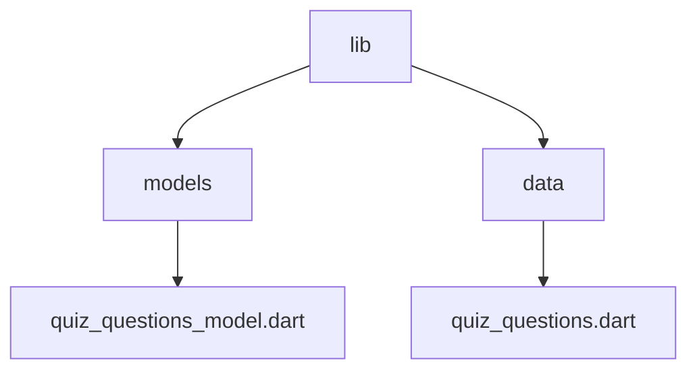

[<-- Part-01.md](https://github.com/PriyathamVarma/Learn-Flutter/blob/main/Quiz-App/Part-01.md) | [Part 03 -->](https://github.com/PriyathamVarma/Learn-Flutter/blob/main/Quiz-App/Part-03.md)

# Part 02

## Terinary Operator

<details>
  <summary>quiz_widget.dart</summary>

```dart
/* This is the widget
   for  quiz 
*/

/* This is the widget for questions
*/

// Imports
// Packages
import "package:flutter/material.dart";
// Stateless
import 'package:quiz_app/stateless_widgets/layout_widgets/start_screen_widget.dart';
// Stateful
import 'package:quiz_app/stateful_widgets/questions_screen_widget.dart';

// Widget
class QuizWidget extends StatefulWidget {
  const QuizWidget({super.key});

  @override
  State<QuizWidget> createState() {
    return _QuizWidgetState();
  }
}

// The return type of DiceRoll class

class _QuizWidgetState extends State<QuizWidget> {
  // Widget? activeScreen; // Pass the pointer

  // // initState
  // @override
  // void initState() {
  //   activeScreen = StartScreen(switchScreen);
  //   super.initState();
  // }

  var activeScreen = 'start_screen_widget';

  void switchScreen() {
    setState(() {
      activeScreen = 'questions_screen_widget';
    });
  }

  @override
  Widget build(context) {
    return MaterialApp(
      home: Scaffold(
        body: Container(
          decoration: const BoxDecoration(
            gradient: LinearGradient(
              begin: Alignment.topLeft,
              end: Alignment(0.8, 1),
              colors: <Color>[
                Color(0xff1f005c),
                Color(0xff5b0060),
                Color(0xff870160),
                Color(0xffac255e),
                Color(0xffca485c),
                Color(0xffe16b5c),
                Color(0xfff39060),
                Color(0xffffb56b),
              ], // Gradient from https://learnui.design/tools/gradient-generator.html
              tileMode: TileMode.mirror,
            ),
          ),
          child: activeScreen == 'start_screen_widget'
              ? StartScreen(switchScreen)
              : const QuestionsWidget(),
        ),
      ),
    );
  }
}
```
</details>

## if condition 

<details>

  <summary>Code</summary>

  ```dart
/* This is the widget
   for  quiz 
*/

/* This is the widget for questions
*/

// Imports
// Packages
import "package:flutter/material.dart";
// Stateless
import 'package:quiz_app/stateless_widgets/layout_widgets/start_screen_widget.dart';
// Stateful
import 'package:quiz_app/stateful_widgets/questions_screen_widget.dart';

// Widget
class QuizWidget extends StatefulWidget {
  const QuizWidget({super.key});

  @override
  State<QuizWidget> createState() {
    return _QuizWidgetState();
  }
}

// The return type of DiceRoll class

class _QuizWidgetState extends State<QuizWidget> {
  // Widget? activeScreen; // Pass the pointer

  // // initState
  // @override
  // void initState() {
  //   activeScreen = StartScreen(switchScreen);
  //   super.initState();
  // }

  var activeScreen = 'start_screen_widget';

  void switchScreen() {
    setState(() {
      activeScreen = 'questions_screen_widget';
    });
  }

  @override
  Widget build(context) {
    // final Widget widgetScreen = activeScreen == 'start_screen_widget'
    //     ? StartScreen(switchScreen)
    //     : const QuestionsWidget();

    Widget widgetScreen = StartScreen(switchScreen);

    // if condition
    if (activeScreen == 'questions_screen_widget') {
      widgetScreen = const QuestionsWidget();
    }

    return MaterialApp(
      home: Scaffold(
        body: Container(
          decoration: const BoxDecoration(
            gradient: LinearGradient(
              begin: Alignment.topLeft,
              end: Alignment(0.8, 1),
              colors: <Color>[
                Color(0xff1f005c),
                Color(0xff5b0060),
                Color(0xff870160),
                Color(0xffac255e),
                Color(0xffca485c),
                Color(0xffe16b5c),
                Color(0xfff39060),
                Color(0xffffb56b),
              ], // Gradient from https://learnui.design/tools/gradient-generator.html
              tileMode: TileMode.mirror,
            ),
          ),
          child: widgetScreen,
        ),
      ),
    );
  }
}
```
</details>

## Data models and Data

Create two folders 

1. models
2. data



<details>

  <summary>Code</summary>

**quiz_questions_model.dart**

```dart
/* 
    This is the data model
    for quiz questions
*/

// This class encapsulates a single quiz question with its possible answers.
// It accepts two arguments in its constructor:
//
// - question: A string representing the text of the question to be displayed.
// - options: A list of strings containing the possible answer choices for the question.
class QuizQuestions {
  // Constructor
  const QuizQuestions(this.question, this.options);
  // Variables
  final String question;
  final List<String> options;
}

```

**quiz_questions.dart**

```dart
/*
  This is for quiz questions
  data
*/

// Imports
import 'package:quiz_app/models/quiz_questions_model.dart';
//import 'package:quiz_app/stateful_widgets/quiz_widget.dart';

const questions = [
  QuizQuestions('Who is your fav person', ["Sneha", "Varma", "Varma2"]),
  QuizQuestions('What is your fav place', ["London", "Vizag", "Hyd"]),
];

```
</details>

## Configuring a column and creating a customizable button

- Create a new folder `elevated_button.dart`

<details>
  <summary>Code</summary>

```dart
/*
  This is the button 
  for quiz questions
  -- Elevated Button
*/

// Imports
import 'package:flutter/material.dart';

class ElevatedButtonWidget extends StatelessWidget {
  const ElevatedButtonWidget({
    super.key,
    required this.answerText,
    required this.answerFunction,
  });

  final String answerText;
  final void Function() answerFunction;

  @override
  Widget build(BuildContext context) {
    return ElevatedButton(
      onPressed: answerFunction,
      style: ElevatedButton.styleFrom(
        backgroundColor: const Color.fromARGB(199, 32, 2, 130),
      ),
      child: Text(answerText),
    );
  }
}

```

</details>

- `questions_screen_widget.dart`

<details>
  <summary>Code</summary>

```dart
/* This is the widget for questions
*/

// Imports
// Packages
//import "dart:math";

import "package:flutter/material.dart";

// Widgets
import 'package:quiz_app/stateless_widgets/button_widgets/elevated_button.dart';

// Data
import 'package:quiz_app/data/quiz_questions.dart';

// Widget
class QuestionsWidget extends StatefulWidget {
  const QuestionsWidget({super.key});

  @override
  State<QuestionsWidget> createState() {
    return _QuestionsWidgetState();
  }
}

// The return type of DiceRoll class

class _QuestionsWidgetState extends State<QuestionsWidget> {
  @override
  Widget build(context) {
    final currentQuestion = questions[1];

    return Column(
      mainAxisAlignment: MainAxisAlignment.center, // Center children vertically
      children: [
        Center(
          child: Text(
            currentQuestion.question,
            style: const TextStyle(fontSize: 24, color: Colors.white),
          ),
        ),
        ElevatedButtonWidget(
            answerText: currentQuestion.options[0],
            answerFunction: () {
              debugPrint("Pressed q1");
            }),
        ElevatedButtonWidget(
            answerText: currentQuestion.options[1],
            answerFunction: () {
              debugPrint("Pressed q2");
            }),
        ElevatedButtonWidget(
            answerText: currentQuestion.options[2],
            answerFunction: () {
              debugPrint("Pressed q3");
            }),
      ],
    );
  }
}

```

</details>

[<-- Part-01.md](https://github.com/PriyathamVarma/Learn-Flutter/blob/main/Quiz-App/Part-01.md) | [Part 03 -->](https://github.com/PriyathamVarma/Learn-Flutter/blob/main/Quiz-App/Part-03.md)
