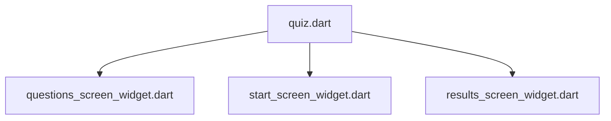

[<-- Part-03.md](https://github.com/PriyathamVarma/Learn-Flutter/blob/main/Quiz-App/Part-01.md) | [Part 05 -->](https://github.com/PriyathamVarma/Learn-Flutter/blob/main/Quiz-App/Part-03.md)


## Using third party packages

> Step 1

```
flutter pub add google_fonts
``` 

> Step 2 : Check in pubspec.yaml

```
dependencies:
  google_fonts: ^6.1.0
```

> Step 3

```
import 'package:google_fonts/google_fonts.dart';
```

## Passing data via functions across widgets



Quiz.dart file has access to the state to change the screens. Now, after answers are selected the answers can be saved in this file. 
Then it can be used to pass them to the results_screen_widget.dart

> quiz.dart

<details> 

<summary>Code</summary>

```dart
/* This is the widget
   for  quiz 
*/

/* This is the widget for questions
*/

// Imports
// Packages
import "package:flutter/material.dart";
// Stateless
import 'package:quiz_app/stateless_widgets/layout_widgets/start_screen_widget.dart';
// Stateful
import 'package:quiz_app/stateful_widgets/questions_screen_widget.dart';

// Widget
class QuizWidget extends StatefulWidget {
  const QuizWidget({super.key});

  @override
  State<QuizWidget> createState() {
    return _QuizWidgetState();
  }
}

// The return type of DiceRoll class

class _QuizWidgetState extends State<QuizWidget> {
  // Widget? activeScreen; // Pass the pointer

  // // initState
  // @override
  // void initState() {
  //   activeScreen = StartScreen(switchScreen);
  //   super.initState();
  // }

  var activeScreen = 'start_screen_widget';
  final List<String> answersSelected = [];

  void switchScreen() {
    setState(() {
      activeScreen = 'questions_screen_widget';
    });
  }

  void chooseAns(String answer) {
    answersSelected.add(answer);
  }

  @override
  Widget build(context) {
    // final Widget widgetScreen = activeScreen == 'start_screen_widget'
    //     ? StartScreen(switchScreen)
    //     : const QuestionsWidget();

    Widget widgetScreen = StartScreen(switchScreen);

    // if condition
    if (activeScreen == 'questions_screen_widget') {
      widgetScreen = QuestionsWidget(
        chooseAnswer: chooseAns,
      );
    }

    return MaterialApp(
      home: Scaffold(
        body: Container(
          decoration: const BoxDecoration(
            gradient: LinearGradient(
              begin: Alignment.topLeft,
              end: Alignment(0.8, 1),
              colors: <Color>[
                Color(0xff1f005c),
                Color(0xff5b0060),
                Color(0xff870160),
                Color(0xffac255e),
                Color(0xffca485c),
                Color(0xffe16b5c),
                Color(0xfff39060),
                Color(0xffffb56b),
              ], // Gradient from https://learnui.design/tools/gradient-generator.html
              tileMode: TileMode.mirror,
            ),
          ),
          child: widgetScreen,
        ),
      ),
    );
  }
}

```

</details>

> questions_screen_widget.dart 

<details> 

<summary>Code</summary>

```dart
/* This is the widget for questions
*/

// Imports
// Packages
//import "dart:math";

import "package:flutter/material.dart";

// Widgets
import 'package:quiz_app/stateless_widgets/button_widgets/elevated_button.dart';

// Data
import 'package:quiz_app/data/quiz_questions.dart';

// Widget
class QuestionsWidget extends StatefulWidget {
  const QuestionsWidget({super.key, required this.chooseAnswer});

  final void Function(String answer) chooseAnswer;

  @override
  State<QuestionsWidget> createState() {
    return _QuestionsWidgetState();
  }
}

// The return type of DiceRoll class

class _QuestionsWidgetState extends State<QuestionsWidget> {
  // Changing the question
  var currentQuestionIndex = 0;

  // Next question method
  void nextQuestion(String answer) {
    widget.chooseAnswer(answer);
    setState(() {
      if (currentQuestionIndex < questions.length - 1) {
        currentQuestionIndex += 1;
      }
    });

    debugPrint('$currentQuestionIndex');
    debugPrint(answer);
  }

  @override
  Widget build(context) {
    final currentQuestion = questions[currentQuestionIndex];

    return Column(
      mainAxisAlignment: MainAxisAlignment.center, // Center children vertically
      children: [
        Center(
          child: Text(
            currentQuestion.question,
            style: const TextStyle(fontSize: 24, color: Colors.white),
          ),
        ),
        ...currentQuestion.options.map(
          (item) {
            return ElevatedButtonWidget(
              answerText: item,
              answerFunction: () {
                nextQuestion(item);
              },
            );
          },
        ).toList(),
      ],
    );
  }
}
```

</details>


## Useful Resources

1. [Flutter packages](https://docs.flutter.dev/packages-and-plugins/using-packages)
2. [Flutter packages Repo](https://pub.dev/)
3. [Google Fonts Package](https://pub.dev/packages/google_fonts)


[<-- Part-03.md](https://github.com/PriyathamVarma/Learn-Flutter/blob/main/Quiz-App/Part-01.md) | [Part 05 -->](https://github.com/PriyathamVarma/Learn-Flutter/blob/main/Quiz-App/Part-03.md)
