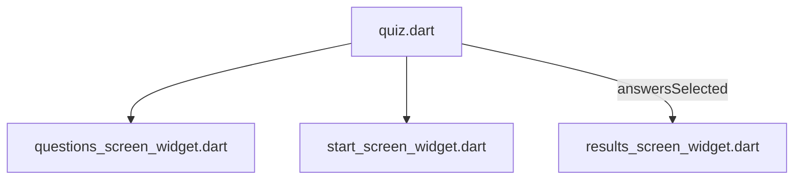
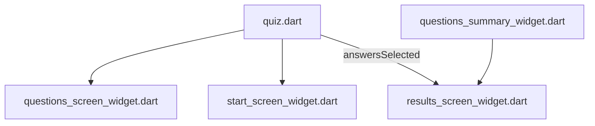

[<-- Part-04.md](https://github.com/PriyathamVarma/Learn-Flutter/blob/main/Quiz-App/Part-04.md) | [Part-06.md -->](https://github.com/PriyathamVarma/Learn-Flutter/blob/main/Quiz-App/Part-06.md)

## Results page

To display the answers selected



> results_screen_widget.dart
>> Observe the List<Map> and for loop


<details>
  <summary>Code</summary>

```dart
/*
  This is the screen for 
  displaying results
*/

/* This is the starting
   screen widget
*/

// Imports
// Packages
// import 'dart:math';

import 'package:flutter/material.dart';

// Widgets
// Stateless

// Stateful
// import 'package:quiz_app/stateful_widgets/questions_screen_widget.dart';
import 'package:quiz_app/data/quiz_questions.dart';

// Class
class ResultsScreen extends StatelessWidget {
  // Constructor
  const ResultsScreen(this.answersSelected, {super.key});

  final List<String> answersSelected;

  // Method
  List<Map<String, Object>> getSummaryData() {
    final List<Map<String, Object>> summary = [];

    for (var i = 0; i < answersSelected.length; i++) {
      summary.add({
        "question_index": i,
        'question': questions[i].question,
        'answer': answersSelected[i]
      });
    }

    return summary;
  }

  void onPressed() => {debugPrint(getSummaryData() as String?)};

  @override
  Widget build(context) {
    return Column(
      mainAxisAlignment: MainAxisAlignment.center, // Center children vertically
      children: [
        Image.asset("assets/images/Quiz-Logo.png"),
        const Center(
          child: Text(
            'Quiz App Results',
            style: TextStyle(fontSize: 24, color: Colors.white),
          ),
        ),
      ],
    );
  }
}
```
</details>

> Create a new file for accessing the summary data



<details>
  <summary>Code</summary>

```dart
/*
  This is a widget for
  summary of questions
*/

import 'package:flutter/material.dart';

class QuestionsSummary extends StatelessWidget {
  const QuestionsSummary(this.summaryData, {super.key});

  final List<Map<String, Object>> summaryData;

  @override
  Widget build(BuildContext context) {
    return Column(
      children: summaryData.map(
        (item) {
          return Row(children: [
            Text(((item['question_index'] as int) + 1).toString()),
            Column(
              children: [
                Text(item['question'] as String),
                Text(item['answer'] as String),
              ],
            )
          ]);
        },
      ).toList(),
    );
  }
}

```

  
</details>


## Passing QuestionsSummary to ResultsPage

> Results Page

<details>
  <summary>Code</summary>

```dart
/*
  This is a widget for
  summary of questions
*/

import 'package:flutter/material.dart';

class QuestionsSummary extends StatelessWidget {
  const QuestionsSummary(this.summaryData, {super.key});

  final List<Map<String, Object>> summaryData;

  @override
  Widget build(BuildContext context) {
    return Center(
      child: Column(
        mainAxisAlignment:
            MainAxisAlignment.center, // Center the entire summary
        children: summaryData.map((item) {
          return Row(
            mainAxisAlignment:
                MainAxisAlignment.center, // Center each question item
            children: [
              Center(
                child: Text(
                  ((item['question_index'] as int) + 1).toString(),
                  style: const TextStyle(fontSize: 34, color: Colors.black),
                ),
              ),
              Center(
                child: Column(
                  mainAxisAlignment:
                      MainAxisAlignment.center, // Center question and answer
                  children: [
                    Text(
                      item['question'] as String,
                      style: const TextStyle(
                          fontSize: 14,
                          color: Colors.white,
                          fontWeight: FontWeight.bold),
                    ),
                    Text(
                      item['answer'] as String,
                      style: const TextStyle(fontSize: 14, color: Colors.black),
                    ),
                  ],
                ),
              ),
            ],
          );
        }).toList(),
      ),
    );
  }
}
```
  
</details>


[<-- Part-04.md](https://github.com/PriyathamVarma/Learn-Flutter/blob/main/Quiz-App/Part-04.md) | [Part-06.md -->](https://github.com/PriyathamVarma/Learn-Flutter/blob/main/Quiz-App/Part-06.md)
