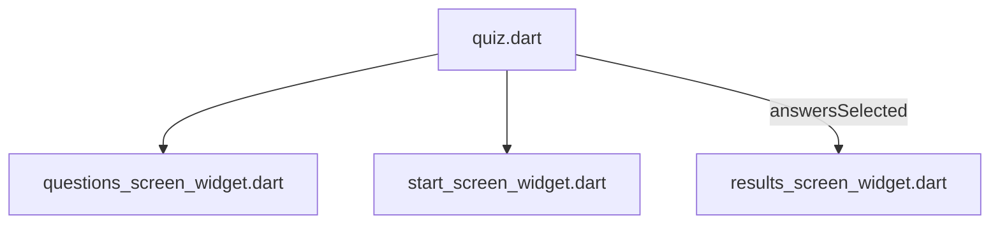

[<-- Part-04.md](https://github.com/PriyathamVarma/Learn-Flutter/blob/main/Quiz-App/Part-04.md) | [Part 06 -->](https://github.com/PriyathamVarma/Learn-Flutter/blob/main/Quiz-App/Part-06.md)

## Results page

To display the answers selected

[<-- Part-04.md](https://github.com/PriyathamVarma/Learn-Flutter/blob/main/Quiz-App/Part-04.md) | [Part 06 -->](https://github.com/PriyathamVarma/Learn-Flutter/blob/main/Quiz-App/Part-06.md)
