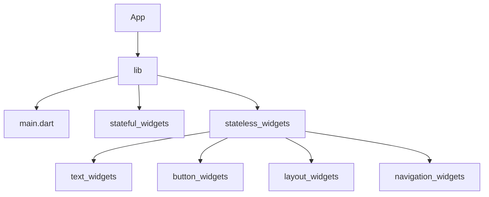

# Quiz App

This project is to create a quiz app using Flutter


## Project Setup

- Create a new project ``` flutter create quiz_app ```

- Run the simulator from the root folder

- Start with the main.dart file in lib folder

## Project Structure



## Table of contents

| S.no | Content | Remarks |
|------|---------|---------|
