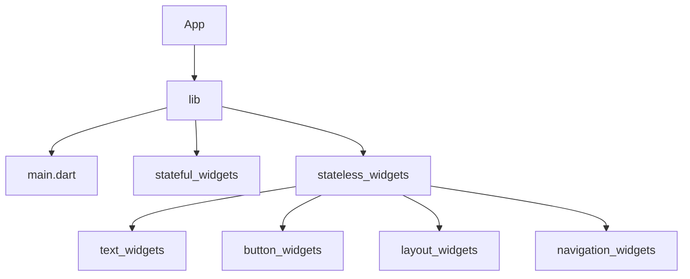

# Quiz App

This project is to create a quiz app using Flutter

## Project Setup

- Create a new project ``` flutter create quiz_app ```

- Run the simulator from the root folder

- Start with the main.dart file in lib folder

## Project Structure


