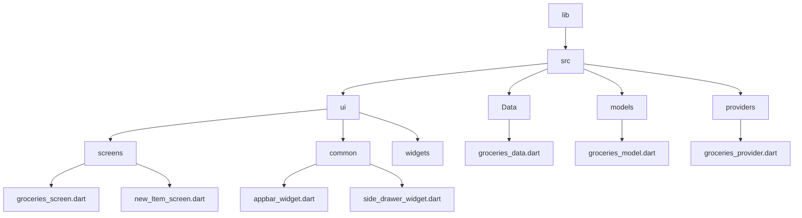

[<-- Part-01.md](https://github.com/PriyathamVarma/Learn-Flutter/blob/main/Meals-App/Part-01.md) | [Part 03 -->](https://github.com/PriyathamVarma/Learn-Flutter/blob/main/Meals-App/Part-03.md)




> new_item_screen.dart


<details>
  <summary>Code</summary>

```dart


```
  
</details>


<details>
  <summary>Code</summary>

```dart


```
  
</details>


<details>
  <summary>Code</summary>

```dart


```
  
</details>


[<-- Part-01.md](https://github.com/PriyathamVarma/Learn-Flutter/blob/main/Meals-App/Part-01.md) | [Part 03 -->](https://github.com/PriyathamVarma/Learn-Flutter/blob/main/Meals-App/Part-03.md)
