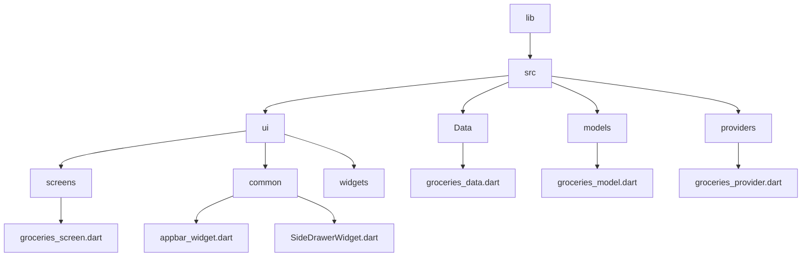

[<-- Part-02.md](https://github.com/PriyathamVarma/Learn-Flutter/blob/main/Shopping-App/Part-02.md) | [Part 04 -->](https://github.com/PriyathamVarma/Learn-Flutter/blob/main/Shopping-App/Part-04.md)

# Using backend for flutter



## Setting up a dummy backend

- Using firebase
- Add a project to the dashboard
- Go to real-time database
- Create database
- Select the zone
- Start in ` **Test mode** `

## Adding `http package`

- Go the [page](https://pub.dev/packages/http/install)
- In the terminal `flutter pub add http`
- `import 'package:http/http.dart'; as http`
  

## Sending a POST request to the backend

```dart

final url = Uri.https(
          '<link from flutter without https://>',
          'shopping-list.json');
      http.post(
        url,
        headers: {
          'content-type': 'application/json',
        },
        body: json.encode({
          "grocery": _enteredGroceryItem,
          "color": _enteredColor,
          "quantity": _enteredQty,
        }),
      );

```

## Working with the request & waiting for the response

> new_item_screen.dart


```dart

/*
  This is for new item
  adding screen
*/

import 'dart:convert';

import 'package:flutter/material.dart';
import 'package:flutter_riverpod/flutter_riverpod.dart';
import 'package:http/http.dart' as http;
import 'package:shopping_app/src/data/groceries_data.dart';
// import 'package:shopping_app/src/models/groceries_model.dart';
import 'package:shopping_app/src/ui/common/appbar_widget.dart';
import 'package:shopping_app/src/ui/common/side_drawer_widget.dart';

class NewItemScreen extends ConsumerStatefulWidget {
  const NewItemScreen({super.key});

  @override
  ConsumerState<NewItemScreen> createState() {
    return _NewItemScreenState();
  }
}

// The return type of DiceRoll class

class _NewItemScreenState extends ConsumerState<NewItemScreen> {
  final _formKey = GlobalKey<FormState>();

  var _enteredGroceryItem = " ";
  var _enteredQty = "";
  var _enteredColor = Colors.white;

  void _saveItem() async {
    if (_formKey.currentState!.validate()) {
      _formKey.currentState!.save();
      debugPrint('$_enteredGroceryItem,$_enteredQty, $_enteredColor');
      final url = Uri.https(
          'flutter-shopping-app-28708-default-rtdb.firebaseio.com',
          'shopping-list.json');
      final res = await http.post(
        url,
        headers: {
          'content-type': 'application/json',
        },
        body: json.encode({
          "grocery": _enteredGroceryItem,
          "color": "white",
          "quantity": _enteredQty,
        }),
      );
      debugPrint(res.body);
      if (!context.mounted) {
        return;
      }
      Navigator.of(context).pop();
    }
  }

  @override
  Widget build(context) {
    return MaterialApp(
      home: Scaffold(
        appBar: const AppBarWidget(title: "New Item"),
        body: Padding(
          padding: const EdgeInsets.all(12),
          child: Form(
            key: _formKey,
            child: Column(
              children: [
                TextFormField(
                  maxLength: 50,
                  decoration: const InputDecoration(
                    label: Text('Enter Grocery'),
                  ),
                  validator: (value) {
                    if (value == null || value.isEmpty) {
                      return "No Value entered";
                    }
                    return null;
                  },
                  onSaved: (value) {
                    _enteredGroceryItem = value!;
                  },
                ),
                TextFormField(
                  maxLength: 50,
                  decoration: const InputDecoration(
                    label: Text('Enter Qty'),
                  ),
                  validator: (value) {
                    if (value == null || value.isEmpty) {
                      return "No Value entered";
                    }
                    return null;
                  },
                  onSaved: (value) {
                    _enteredQty = value!;
                  },
                ),
                DropdownButtonFormField(
                  items: [
                    for (final color in availableColors)
                      DropdownMenuItem(
                        value: color,
                        child: Container(
                          width: 100,
                          height: 50,
                          color: color,
                        ),
                      ),
                  ],
                  onChanged: (color) {
                    _enteredColor = color!;
                  },
                ),
                Row(
                  children: [
                    ElevatedButton(
                      onPressed: _saveItem,
                      style: ElevatedButton.styleFrom(
                        backgroundColor: Colors.black,
                        foregroundColor: Colors.white,
                        shape: RoundedRectangleBorder(
                            borderRadius: BorderRadius.circular(5)),
                      ),
                      child: const Text('Submit'),
                    ),
                    const SizedBox(width: 20),
                    ElevatedButton(
                      onPressed: () {
                        _formKey.currentState!.reset();
                      },
                      style: ElevatedButton.styleFrom(
                        backgroundColor: Colors.black,
                        foregroundColor: Colors.white,
                        shape: RoundedRectangleBorder(
                            borderRadius: BorderRadius.circular(5)),
                      ),
                      child: const Text('Reset'),
                    ),
                  ],
                )
              ],
            ),
          ),
        ),
        drawer: const SideDrawerWidget(),
      ),
    );
  }
}


```


## Resources

1. [Firebase](https://firebase.google.com/)
2. [Firebase flutter documentation](https://docs.flutter.dev/data-and-backend/firebase)
3. [Setting up flutter](https://medium.com/@FlutterStudio/a-complete-guide-to-setting-up-firebase-in-flutter-5bf3c7356dc7)
4. [Flutter HTTP package](https://pub.dev/packages/http/install)

[<-- Part-02.md](https://github.com/PriyathamVarma/Learn-Flutter/blob/main/Shopping-App/Part-02.md) | [Part 04 -->](https://github.com/PriyathamVarma/Learn-Flutter/blob/main/Shopping-App/Part-04.md)
