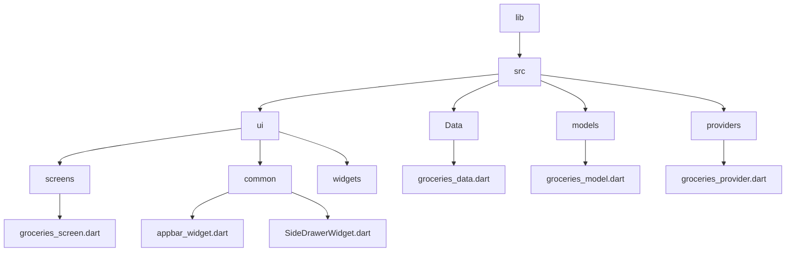

[<-- Part-03.md](https://github.com/PriyathamVarma/Learn-Flutter/blob/main/Shopping-App/Part-03.md) | [Part 05 -->](https://github.com/PriyathamVarma/Learn-Flutter/blob/main/Shopping-App/Part-05.md)

## Fetching and transforming data



```dart
final url = Uri.https(
       "<link>.com",
      'shopping-list.json');

    void fetchData() async {
      //var groceriesDataFromFirebase = await http.get(url).then((value) => null);
    }

```


[<-- Part-03.md](https://github.com/PriyathamVarma/Learn-Flutter/blob/main/Shopping-App/Part-03.md) | [Part 05 -->](https://github.com/PriyathamVarma/Learn-Flutter/blob/main/Shopping-App/Part-05.md)
