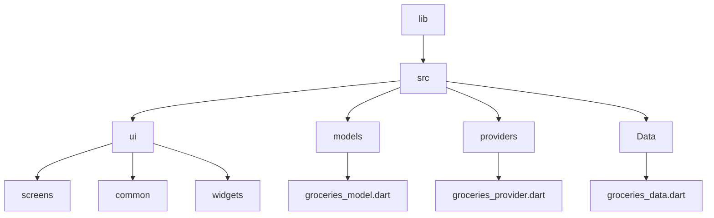
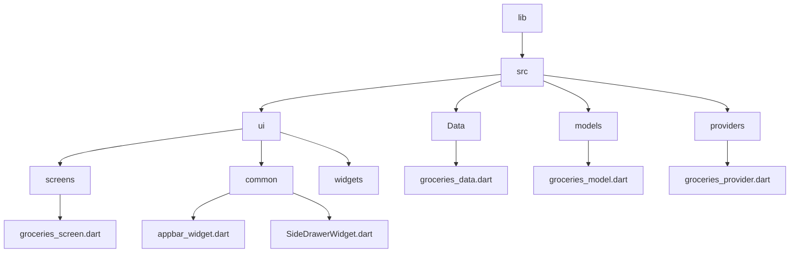

[Part 01 -->](https://github.com/PriyathamVarma/Learn-Flutter/blob/main/Meals-App/Part-01.md)

# Shopping App



> main.dart

<details>
  <summary>Code</summary>

```dart
// This is the main dart file
// IMPORTS
import 'package:flutter/material.dart';
import 'package:shopping_app/src/ui/screens/groceries_screen.dart';

void main() {
  runApp(
    MaterialApp(
      theme: ThemeData().copyWith(
        scaffoldBackgroundColor: Colors.white,
        cardColor: Colors.amberAccent,
        // textTheme: GoogleFonts.latoTextTheme(),
      ),
      home: const GroceriesScreen(),
    ),
  );
}

```
  
</details>


> groceries_screen.dart


<details>
  <summary>Code</summary>

```dart
/* 
  This is the widget
   for  groceries
*/

// Imports
// Packages
import "package:flutter/material.dart";
import "package:shopping_app/src/data/groceries_data.dart";
import "package:shopping_app/src/models/groceries_model.dart";

class GroceriesScreen extends StatelessWidget {
  const GroceriesScreen({super.key});

  final List<Grocery> groceries = dummyGroceries;

  @override
  Widget build(context) {
    Widget activeContent;

    if (dummyGroceries.isEmpty) {
      activeContent = const Text('No groceries');
    } else {
      activeContent = ListView.builder(
        itemCount: dummyGroceries.length,
        itemBuilder: (context, index) {
          final grocery = dummyGroceries[index];

          return Card(
            color: grocery.color.withOpacity(0.3), // Use color with opacity
            child: ListTile(
              title: Text(grocery.grocery),
              subtitle: Text("Quantity: ${grocery.quantity}"),
              trailing: const Icon(Icons.shopping_cart),
            ),
          );
        },
      );
    }

    return MaterialApp(
      home: Scaffold(
        appBar: AppBar(
          title: const Text("Groceries"),
          actions: <Widget>[
            IconButton(
              icon: const Icon(Icons.add),
              onPressed: () {},
            ),
          ],
        ),
        body: Center(
          child: activeContent,
        ),
      ),
    );
  }
}

```
  
</details>

> groceries_model.dart


<details>
  <summary>Code</summary>

```dart
/*
  This is the model for 
  groceries data
*/

import 'package:flutter/material.dart';

class Grocery {
  const Grocery({
    required this.id,
    required this.grocery,
    required this.color,
    required this.quantity,
  });

  final String id;
  final String grocery;
  final Color color;
  final double quantity;
}

```
  
</details>


> groceries_data.dart

<details>
  <summary>Code</summary>

```dart
/* 
  This is the dummy groceries data
*/

import 'package:flutter/material.dart';
import 'package:shopping_app/src/models/groceries_model.dart';

const dummyGroceries = [
  Grocery(id: "1", grocery: "Milk", color: Colors.blue, quantity: 1),
  Grocery(id: "2", grocery: "Bananas", color: Colors.green, quantity: 5),
  Grocery(id: "3", grocery: "Beef Steak", color: Colors.orange, quantity: 1),
];

```
  
</details>


## Further improving with providers and appbar widget


> appbar_widget.dart

<details>
  <summary>Code</summary>

```dart
/*
  This is the common widget for appbar
*/

import 'package:flutter/material.dart';

class AppBarWidget extends StatelessWidget implements PreferredSizeWidget {
  const AppBarWidget({super.key, required this.title});

  final String title;

  @override
  Widget build(BuildContext context) {
    return AppBar(
      title: Text(title),
      actions: <Widget>[
        IconButton(
          icon: const Icon(Icons.add),
          onPressed: () {},
        ),
      ],
    );
  }

  @override
  Size get preferredSize => const Size.fromHeight(kToolbarHeight);
}

```
  
</details>

> SideDrawerWidget.dart

<details>
  <summary>Code</summary>

```dart

/*
  This is the side drwaer widget
*/

import 'package:flutter/material.dart';

class SideDrawerWidget extends StatelessWidget {
  const SideDrawerWidget({super.key});

  @override
  Widget build(BuildContext context) {
    return Drawer(
      child: ListView(
        padding: EdgeInsets.zero,
        children: [
          const DrawerHeader(
            decoration: BoxDecoration(
              color: Colors.yellowAccent,
            ),
            child: Text('Company Name'),
          ),
          ListTile(
            title: const Text('Favorites'),
            onTap: () => {}, // Handle tap actions
          ),
          ListTile(
            title: const Text('New Item'),
            onTap: () => {},
          ),
        ],
      ),
    );
  }
}


```
  
</details>


[Part 01 -->](https://github.com/PriyathamVarma/Learn-Flutter/blob/main/Meals-App/Part-01.md)
